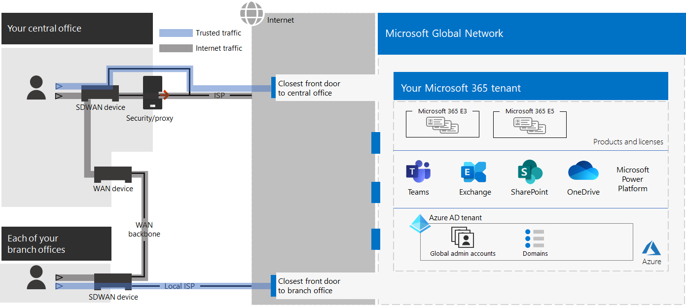

# Stap 2. Optimale netwerken voor uw Microsoft 365 voor bedrijfs tenants

Microsoft 365 voor Enterprise bevat Cloud productiviteits-apps zoals teams en Exchange Online, en Microsoft intune, samen met tal van identiteits-en beveiligingsservices van Microsoft Azure. Al deze services op de Cloud zijn afhankelijk van de beveiliging, de prestaties en de betrouwbaarheid van verbindingen van clientapparaten op uw on-premises netwerk of op een andere locatie op internet. 

Als u de netwerktoegang voor uw Tenant wilt optimaliseren, moet u het volgende doen:

- Optimaliseer het pad tussen uw on-premises gebruikers en de dichtstbijzijnde locatie van het globale Microsoft-netwerk.
- Optimaliseer de toegang tot het Microsoft Global Network voor uw externe gebruikers die een VPN-oplossing voor externe toegang gebruiken.
- Gebruik netwerk inzichten om de netwerkverbinding voor uw Office-locaties te ontwerpen.
- Optimaliseer de toegang tot bepaalde assets die worden gehost op SharePoint-sites met Office 365 CDN.
- Configureer proxy-en netwerkedge-apparaten om de verwerking van het vertrouwens verkeer voor Microsoft 365 met de lijst met eindpunten te omzeilen en de update van de lijst te automatiseren wanneer er wijzigingen worden aangebracht.

## On-premises bedrijven-medewerkers

Voor Enterprise-netwerken dient u de eindgebruikers ervaring te optimaliseren door de beste netwerktoegang tussen clients en de dichtstbijzijnde Microsoft 365-eindpunten in te schakelen. De kwaliteit van de eindgebruikers ervaring is direct gerelateerd aan de werking en de reactiesnelheid van de toepassing die de gebruiker gebruikt. In Microsoft teams is bijvoorbeeld gebruikgemaakt van lage latentie, zodat de telefoonnummers van de gebruikers, vergaderingen en gedeelde scherm samenwerking geen storingen hebben.

Het primaire doel van het netwerkontwerp moet de latentie van de round-trip (RTT) van de clientapparaten in het Microsoft Global-netwerk minimaliseren, de openbare netwerkbackbone van Microsoft die alle databases van Microsoft verbindt met lage latentie, over de Cloud voor hoge beschikbaarheid en verspreid over de hele wereld.

Hier ziet u een voorbeeld van een traditioneel bedrijfsnetwerk.

In deze afbeelding maken filialen verbinding met een centrale Office via WAN-apparaten (Wide Area Network) en een WAN-backbone. Internet toegang is via een beveiligings-of proxy apparaat op de netwerkkant van het centrale kantoor en een internetprovider (ISP). Op internet heeft het Microsoft Global Network een reeks voor deur punten in regio's over de hele wereld. Organisaties kunnen ook tussenliggende locaties gebruiken voor het verwerken van extra pakketten en beveiliging van verkeer. De Microsoft 365-Tenant van een organisatie bevindt zich in het globale Microsoft-netwerk.

De problemen met deze configuratie voor Microsoft 365-cloudservices zijn:

- Voor gebruikers van filialen wordt verkeer verzonden naar niet-lokale front deuren, vergroot de latentie.
- Verkeer naar tussenliggende locaties verzenden Maak een netwerk hairpins die de verwerking van dubbele pakketten op vertrouwd verkeer uitvoert, vergroot de latentie.
- Netwerk edge-apparaten zijn niet nodig en dubbele pakketverwerking op vertrouwd verkeer, vergroot de latentie.

Het optimaliseren van de prestaties van Microsoft 365 Network hoeft niet ingewikkeld te zijn. U krijgt de best mogelijke prestaties door een aantal van de belangrijkste beginselen te volgen:

- Identificeer Microsoft 365-netwerkverkeer, dat wordt vertrouwd met Microsoft-cloudservices.
- Sta lokale vertakkingen af van Microsoft 365-netwerkverkeer naar Internet vanaf elke locatie waar gebruikers verbinding maken met Microsoft 365.
- Vermijd netwerk hairpins.
- Sta Microsoft 365-verkeer toe om proxy's en pakket inspectie apparaten over te slaan.

Als u deze principes implementeert, ontvangt u een Enterprise-netwerk dat is geoptimaliseerd voor Microsoft 365.

In deze afbeelding hebben filialen hun eigen Internet verbinding via een door een software gedefinieerd WAN-apparaat (SDWAN), dat vertrouwde Microsoft 365-verkeer verzendt naar de buurt van de buurt. In de centrale versie van Office worden vertrouwde Microsoft 365-verkeer overgeslagen van het beveiligings-of proxy apparaat en van tussenliggende apparaten die niet meer worden gebruikt.

Hier ziet u hoe de geoptimaliseerde configuratie de latentie problemen van een traditioneel Enterprise-netwerk oplost.

- Vertrouwd Microsoft 365-verkeer overslaat de WAN-backbone en wordt verzonden naar lokale deuren voor alle kantoren, waarbij de latentie wordt verlaagd.
- Netwerk hairpins die het uitvoeren van dubbele pakketverwerking, worden overgeslagen voor vertrouwde Microsoft 365, waardoor de latentie daalt.
- Netwerk edge-apparaten die zijn gedupliceerd en dubbele pakketverwerking, worden overgeslagen voor vertrouwde Microsoft 365, waarbij de latentie wordt verlaagd.

Voor meer informatie raadpleegt u [Microsoft 365 Network Connectivity Overview](../enterprise/microsoft-365-networking-overview.md).

## Externe werknemers

Als uw externe medewerkers een traditionele VPN-client gebruiken om extern toegang te krijgen tot uw bedrijfsnetwerk, verifieer dan dat de VPN-client split tunneling ondersteunt. Zonder split tunneling wordt al uw externe werk verzonden via de VPN-verbinding, terwijl het moet worden doorgestuurd naar de edge-apparaten van uw bedrijf, worden verwerkt en dan verzonden op internet. Hier volgt een voorbeeld.

In deze afbeelding moet Microsoft 365-verkeer een indirecte route via uw organisatie ondervinden, wat vanaf de fysieke locatie van de VPN-client ver van de fysieke locatie van de VPN-client kan worden doorgestuurd naar een Microsoft-hoofd netwerk voor de client. Met dit indirecte pad wordt een vertraging toegevoegd aan het netwerkverkeer en wordt de algehele prestatie negatief beïnvloed.  

Met split tunneling kunt u uw VPN-client zo configureren dat specifieke typen verkeer niet via de VPN-verbinding naar het bedrijfsnetwerk worden verzonden.

Configureer uw split tunneling VPN-clients zodanig dat verkeer wordt uitgesloten naar de Microsoft 365-eindpuntcategorie **Optimaliseren** over de VPN-verbinding om toegang tot Microsoft 365-cloudresources te optimaliseren. Zie voor meer informatie [Office 365-eindpunt categorieën](../enterprise/microsoft-365-network-connectivity-principles.md#new-office-365-endpoint-categories) en [de lijsten voor het](../enterprise/microsoft-365-vpn-implement-split-tunnel.md#implement-vpn-split-tunneling) optimaliseren van categorie-eindpunten voor gesplitste tunneling.

Dit is het resultaat van de gesplitste overdracht, waarbij het grootste deel van het verkeer naar Microsoft 365 Cloud-apps de VPN-verbinding negeert.

In deze afbeelding stuurt de VPN-client het Microsoft 365 cloudservice verkeer rechtstreeks via internet en de dichtstbijzijnde front-deur in het Microsoft Global-netwerk.

Bekijk [Office 365-connectiviteit optimaliseren voor externe gebruikers met VPN-split-tunneling](../enterprise/microsoft-365-vpn-split-tunnel.md) voor meer informatie en richtlijnen.

## Werken met netwerk inzichten (preview)

Netwerk inzichten zijn prestatiegegevens die worden verzameld via uw Microsoft 365-Tenant waarmee u Netwerkverbindingen voor uw Office-locaties kunt ontwerpen. Elk inzicht biedt actuele informatie over de prestatie-eigenschappen voor een bepaald probleem voor elke geografische locatie waar on-premises gebruikers toegang hebben tot uw Tenant.

Er zijn twee netwerk inzichten op tenantniveau die kunnen worden weergegeven voor de Tenant:

- [Gesamplinge verbindingen van Exchange beïnvloed door verbindingsproblemen](../enterprise/office-365-network-mac-perf-insights.md#exchange-sampled-connections-impacted-by-connectivity-issues)
- [Gepipetteerde SharePoint-verbindingen beïnvloed door verbindingsproblemen](../enterprise/office-365-network-mac-perf-insights.md#sharepoint-sampled-connections-impacted-by-connectivity-issues)

Dit zijn de specifieke netwerk inzichten voor elke kantoorlocatie:

- [Backhauled netwerk uitgang](../enterprise/office-365-network-mac-perf-insights.md#backhauled-network-egress)
- [Betere prestaties vastgesteld voor klanten in de buurt](../enterprise/office-365-network-mac-perf-insights.md#better-performance-detected-for-customers-near-you)
- [Het gebruik van een niet-optimale Exchange Online-service-voor deur](../enterprise/office-365-network-mac-perf-insights.md#use-of-a-non-optimal-exchange-online-service-front-door)
- [Het gebruik van een niet-optimale SharePoint Online-service front deur](../enterprise/office-365-network-mac-perf-insights.md#use-of-a-non-optimal-sharepoint-online-service-front-door)
- [Lage downloadsnelheid van SharePoint-voor deur](../enterprise/office-365-network-mac-perf-insights.md#low-download-speed-from-sharepoint-front-door)
- [Gebruikers van China optimale netwerk uitgang](../enterprise/office-365-network-mac-perf-insights.md#china-user-optimal-network-egress)

>[!IMPORTANT]
>Netwerk inzichten, aanbevelingen en beoordelingen in het Microsoft 365-Beheercentrum is momenteel in de preview-status. Het is alleen beschikbaar voor Microsoft 365-tenants die zijn geregistreerd in het functie voorbeeldprogramma.

Zie [Microsoft 365 Network Insights](../enterprise/office-365-network-mac-perf-insights.md)voor meer informatie.

## SharePoint-prestaties met het Office 365 CDN

Met een in de cloud gebaseerde Content Delivery Network (CDN) kunt u laadtijden reduceren, bandbreedte besparen en tijd besparen. Met een CDN verbetert u de prestaties door statische activa zoals afbeeldings-of videobestanden dichter bij de browser te bezorgen, zodat u de downloads sneller kunt versnellen en de latentie kunt verlagen. U kunt met behulp van het ingebouwde Office 365 Content Delivery Network (CDN), dat deel uitmaakt van SharePoint, in Microsoft 365 E3 en E5 vaste activa hosten om betere prestaties te leveren voor uw SharePoint-pagina's.

Het CDN van Office 365 is samengesteld uit meerdere Cdn's die u in staat stellen statische activa te hosten op meerdere locaties of _herkomst_ en ze van wereldwijde hogesnelheids netwerken te bezorgen. Afhankelijk van het type inhoud dat u wilt hosten in Office 365 CDN, kunt u **openbare** Origins, **persoonlijke** oorsprong of beide toevoegen.

Wanneer de Office 365 CDN wordt geïmplementeerd en geconfigureerd, worden de assets van openbare en persoonlijke Origins geüpload en worden ze voor snelle toegang tot gebruikers op internet beschikbaar gemaakt.

Zie [het Office 365-CDN gebruiken met SharePoint Online](../enterprise/use-microsoft-365-cdn-with-spo.md)voor meer informatie.

## Lijst met geautomatiseerde eindpunten

Als u wilt dat uw on-premises cliënten, edge-apparaten en op cloud gebaseerde pakket analyseservices worden 365 verwerkt, moet u deze configureren met de set eindpunten (IP-adresbereiken en DNS-namen) die corresponderen met de Microsoft 365-Services. U kunt deze eindpunten handmatig configureren in firewalls en andere Edge-beveiligingsapparaten, PAC-bestanden voor clientcomputers om proxy's te omzeilen of een SD-WAN-apparaat bij filialen. De eindpunten veranderen echter in de loop van de tijd, waarbij het handmatig onderhoud van de eindpuntlijsten op deze locaties moet worden uitgevoerd.

Als u de vermelding en wijzigingsbeheer voor Microsoft 365-eindpunten wilt automatiseren in de client PAC-bestanden en netwerkapparaten, gebruikt u het [IP-adres en de rest-webservice van Office 365](../enterprise/microsoft-365-ip-web-service.md). Met deze service kunt u het netwerkverkeer van Microsoft 365 beter identificeren en differentiëren, zodat u gemakkelijker de meest recente wijzigingen kunt evalueren, configureren en de meest recente wijzigingen kunt bijhouden.

U kunt PowerShell, python of andere talen gebruiken om de wijzigingen in eindpunten in de loop van de tijd te bepalen en uw PAC-bestanden en Edge-netwerkapparaten te configureren.

Het basisproces luidt als volgt:

1. Gebruik de IP-adressen en URL van Office 365 en het configuratie mechanisme van uw keuze om uw PAC-bestanden en netwerkapparaten te configureren met de huidige set Microsoft 365-eindpunten.
2. Voer dagelijks een periodieke uitvoering uit om te controleren op wijzigingen in de eindpunten of een meldings methode te gebruiken.
3. Wanneer er wijzigingen zijn gevonden, moet u het PAC-bestand voor clientcomputers opnieuw genereren en opnieuw distribueren en de wijzigingen aanbrengen in uw netwerkapparaten.

Zie voor meer informatie [Office 365 IP Address en URL web service](../enterprise/microsoft-365-ip-web-service.md).

## Resultaten van stap 2

Voor uw Microsoft 365-Tenant met optimale netwerkfuncties hebt u het volgende vastgesteld:

- De prestaties van het netwerk voor on-premises gebruikers optimaliseren door Internet verbindingen toe te voegen aan alle filialen en netwerk hairpinsen te elimineren.
- U kunt een geautomatiseerde lijst met vertrouwde eindpunten implementeren voor uw op client gebaseerde PAC-bestanden en uw netwerkapparaten en-services, inclusief voortdurende updates (vooral geschikt voor Enterprise-netwerken).
- De toegang van externe werknemers tot on-premises resources ondersteunen.
- Netwerk inzichten gebruiken
- Het Office 365 CDN implementeren.

Hier ziet u een voorbeeld van een bedrijfsorganisatie en de bijbehorende Tenant met optimale netwerken.

[Een grotere versie van deze afbeelding weergeven](https://github.com/MicrosoftDocs/microsoft-365-docs/raw/public/microsoft-365/media/tenant-management-overview/tenant-management-tenant-build-step2.png)

In deze afbeelding is de Tenant van deze bedrijfsorganisatie:

- Lokale Internet toegang voor elk filiaal met een SDWAN-apparaat waarmee vertrouwde Microsoft 365-verkeer naar een lokale voor deur wordt doorgestuurd.
- Geen netwerk hairpins.
- Centrale Office-beveiligings-en proxy edge-apparaten die Microsoft 365 vertrouwd verkeer doorsturen naar een lokale front-deur.

## Voortdurende onderhoud voor optimale netwerk

Het kan zijn dat u het volgende moet doen:

- Werk de edge-apparaten en de gebruikte PAC-bestanden uit voor wijzigingen in eindpunten of Controleer of de geautomatiseerde procedure goed werkt.
- Beheer de elementen in het CDN van Office 365.
- Update de gesplitste tunnelconfiguratie voor uw VPN-clients voor wijzigingen in eindpunten.

## Volgende stap

Ga verder met de [identiteit](tenant-management-identity.md) voor het synchroniseren van uw on-premises accounts en groepen, en beveiliging van gebruikers registreren.
