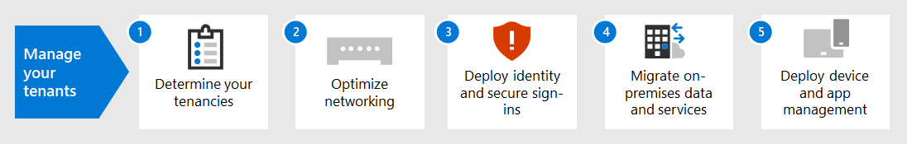

# Tenantbeheer voor Microsoft 365 voor ondernemingen

Voor het maken van een pad naar de digitale transformatie van uw organisatie met cloud computing is een vaste basis vereist waarop uw werknemers kunnen vertrouwen op productiviteit, samenwerking, prestaties, privacy, compliance en beveiliging.

De juiste configuratie van uw Microsoft 365-tenants biedt die basis, zodat uw werknemers zich volledig moeten richten op het doen van hun werk en uw IT-afdeling zich kunnen richten op end-to-end oplossingen die extra zakelijke waarde bieden. 

Deze oplossing brengt u in de volgende stappen door de configuratie van die basis:

1. Uw tenants bepalen
2. Uw netwerk optimaliseren
3. Uw identiteiten synchroniseren en veilige aanmeldingen afdwingen
4. Uw Windows-apparaten, Office-clients en on-premises Office-servers en -gegevens migreren
5. Apparaat- en app-beheer implementeren

Maar laten we eerst even kijken wat een tenant is en hoe een tenant die een goede basis biedt eruitziet.

## Een gedefinieerde Microsoft 365-tenant

Een Microsoft 365-tenant is een speciaal exemplaar van de services van Microsoft 365 en de gegevens van uw organisatie die zijn opgeslagen op een specifieke standaardlocatie, zoals Europa of Noord-Amerika. Deze locatie wordt opgegeven wanneer u de tenant voor uw organisatie maakt. Elke Microsoft 365-tenant is uniek en gescheiden van alle andere Microsoft 365-tenants. U maakt een Microsoft 365-tenant wanneer u een of meer producten van Microsoft koopt, zoals Microsoft 365 E3 of E5, en een aantal licenties voor elke tenant.

Uw Microsoft 365-tenant bevat ook een Azure Active Directory-tenant (Azure AD), een speciaal exemplaar van Azure AD voor gebruikersaccounts, groepen en andere objecten. Elke Azure AD-tenant is uniek, en gescheiden van alle andere Azure AD-tenants. Hoewel uw organisatie meerdere Azure AD-tenants kan hebben die u kunt instellen voor Azure-abonnementen, kunnen Microsoft 365-tenants slechts één Azure AD-tenant gebruiken, de tenant die is gemaakt toen u de tenant maakte. 

Hier is een voorbeeld:

*Tenantbeheer* is de planning, implementatie en doorlopende werking van uw Microsoft 365-tenants. 

## Kenmerken van een goed ontworpen en werkende tenant

Naast de juiste naam en locatie voor uw tenant zijn er extra elementen die u kunt plannen, implementeren en beheren om ervoor te zorgen dat uw gebruikerservaringen met cloudproductiviteitsapps zoals Microsoft Teams en Exchange Online effectief, veilig en &mdash; &mdash; presterend zijn.

Dit zijn de elementen:

- U hebt de juiste set producten (abonnementen) en licenties.
  - De set producten komt overeen met uw bedrijfs-, IT- en beveiligingsbehoeften.
  - Er is voldoende licenties voor uw werknemers en de verwachte veranderingen in de personeels personeels personeelsaantal.
- Voor netwerken:
  - U hebt de juiste DNS-domeinnamen geconfigureerd.
  - Voor bedrijfsnetwerken hebt u netwerkverkeer naar het Microsoft-netwerk geoptimaliseerd voor werknemers ter plekke.
  - U hebt netwerkverkeer geoptimaliseerd voor externe medewerkers die een VPN-client gebruiken.
- U hebt uw AD DS-accounts (Active Directory Domain Services) en andere objecten gesynchroniseerd.
  - Uw Azure AD-tenantaccounts worden met de juiste DNS-domeinen voor e-mailadressen toegesneden aan Exchange Online-postvakken.
  - Aan uw gebruikersaccounts zijn de juiste licenties toegewezen van de juiste gekochte producten (zoals Microsoft 365 E3 of E5).
- U hebt sterk identiteits- en toegangsbeheer geconfigureerd.
  - U hebt een veilige aanmelding van gebruikers met wachtwoordloze of meervoudige verificatie (MFA) nodig.
  - U hebt beleidsregels voor voorwaardelijke toegang die aanmeldingsvereisten en beperkingen voor hogere beveiligingsniveaus afdwingen.
- On-premises Office-servers en de gegevens zijn gemigreerd naar cloud-apps of worden gebruikt in een hybride configuratie.
- U doet apparaatbeheer met Intune of Basic Mobility and Security, ingebouwd in Microsoft 365.
  - Apparaten die eigendom zijn van uw organisatie, worden geregistreerd en beheerd.
  - De apps voor persoonlijke apparaten worden beheerd.

Hier is een voorbeeld van een Microsoft 365-tenant met al deze elementen.

In deze afbeelding bevat de Microsoft 365-tenant het volgende:

- Producten en licenties voor Microsoft 365 E3 en E5.
- Microsoft 365-productiviteitsapps.
- Intune met geregistreerd apparaten en apparaat- en toepassingsbeleid.
- Een Azure AD-tenant met gesynchroniseerde gebruikersaccounts (groepen en andere adreslijstobjecten worden niet weergegeven), domeinen en beleidsregels voor voorwaardelijke toegang.

## Tenantmogelijkheden voor Microsoft 365 voor ondernemingen

In de volgende secties en tabel staan de belangrijkste mogelijkheden en licenties voor de stappen in deze oplossing vermeld.

### Tenant

| Functie | Beschrijving | Licenties |
|:-------|:-----|:-------|
| Meerdere tenants | Elke Microsoft 365-tenant is uniek en gescheiden van alle andere Microsoft 365-tenants. Bij meerdere tenants zijn er beperkingen en extra overwegingen bij het beheren van de tenants en het leveren van services aan uw gebruikers. | Microsoft 365 E3 of E5 | 
| Migratie van postvakken tussen tenants | Tenantbeheerders kunnen postvakken verplaatsen tussen tenants met minimale infrastructuurafhankelijkheden in hun on-premises systemen. Hiermee verwijdert u de noodzaak om postvakken aan de andere bord- en onboard-app toe te laten. | Microsoft 365 E3 of E5 | 
| Multi-Geo | Uw tenant kan gegevens in rust opslaan in de andere geografische datacenterlocaties die u hebt gekozen om te voldoen aan de vereisten voor gegevensopslag. | Microsoft 365 E3 of E5 | 
| Kerngegevens verplaatsen naar een nieuw geografisch datacenter | Wanneer Microsoft nieuwe geografische datacenters toevoegt voor extra capaciteits- en berekeningsbronnen, kunt u een geografische verplaats in een datacenter aanvragen voor in-geo-opslag voor uw kernklantgegevens. | Microsoft 365 E3 of E5 | 
||||

### Netwerken

| Functie | Beschrijving | Licenties |
|:-------|:-----|:-------|
| Netwerkinzichten | De metrische netwerkprestaties die worden verzameld via uw Microsoft 365-tenant, om u te helpen bij het ontwerpen van netwerkperimeters voor uw kantoorlocaties. | Microsoft 365 E3 of E5 | 
| Eindpuntupdates automatiseren | Automatiseer de configuratie en doorlopende updates voor Microsoft 365-eindpunten in uw PAC-clientbestanden en netwerkapparaten en -services. | Microsoft 365 E3 of E5 | 
||||

### Identiteit

| Functie | Beschrijving | Licenties |
|:-------|:-----|:-------|
| On-premises Active Directory Domain Services (AD DS) synchroniseren met uw Azure AD-tenant    | Gebruik uw on-premises identiteitsprovider voor gebruikersaccounts, groepen en andere objecten. | Microsoft 365 E3 of E5 |
| Afgedwongen door MFA en met standaardbeveiligingsinstellingen   | Voorkom gecompromitteerde identiteiten en apparaten met een tweede vorm van verificatie voor aanmeldingen. Als standaardinstelling voor de beveiliging is MFA vereist voor alle gebruikersaccounts.   | Microsoft 365 E3 of E5 |
| Afgedwongen door MFA en met voorwaardelijke toegang| MFA vereisen op basis van de kenmerken van de aanmelding met beleidsregels voor voorwaardelijke toegang.    | Microsoft 365 E3 of E5 | 
| Afgedwongen door MFA en met voorwaardelijke toegang op basis van risico   | Vereis MFA op basis van het risico van de gebruikersaanmelding met Microsoft Defender for Identity. | Microsoft 365 E5 of E3 met Azure AD Premium P2-licenties | 
| Selfservice voor wachtwoordherstel (SSPR)    | Sta toe dat gebruikers hun wachtwoorden of accounts opnieuw kunnen instellen of ontgrendelen.  | Microsoft 365 E3 of E5 |
||||

### Migratie

| Functie | Beschrijving | Licenties |
|:-------|:-----|:-------|
| Migreren naar Windows 10 | Migreert uw apparaten met Windows 7 of Windows 8.1 naar Windows 10 Enterprise. | Windows 10 Enterprise-licenties inbegrepen in Microsoft 365 E3 of E5 | 
| Migreren naar Microsoft 365-apps voor ondernemingen | Migreert uw Office-clientapps zoals Word en PowerPoint naar de versies die zijn geïnstalleerd vanuit de cloud en die worden bijgewerkt met nieuwe functies. | Microsoft 365 E3 of E5 | 
| On-premises servers en gegevens migreren naar Microsoft 365 | Migreert uw Exchange-postvakken, SharePoint-sites en Skype voor Bedrijven Online naar Microsoft 365-cloudservices. | Microsoft 365 E3 of E5 | 
||||

### Apparaat- en app-beheer

| Functie | Beschrijving | Licenties |
|:-------|:-----|:-------|
| Microsoft Intune | Een cloudservice die mobile device management (MDM) en mobile application management (MAM) biedt om te bepalen hoe de toepassing en de apparaten van uw organisatie worden gebruikt, waaronder mobiele telefoons, tablets en laptops. | Microsoft 365 E3 of E5 | 
| Basic Mobility en Security | Beveilig en beheer de mobiele apparaten van uw gebruikers, zoals iPhones, iPads, Android-telefoons en Windows-telefoons met deze ingebouwde service.  | Microsoft 365 E3 of E5 | 
||||

## Volgende stappen

Gebruik deze stappen voor het instellen en beheren van uw Microsoft 365-tenants.

1. [Uw tenants bepalen](tenant-management-tenants.md)
2. [Uw netwerk optimaliseren](tenant-management-networking.md)
3. [Uw identiteiten synchroniseren en veilige aanmeldingen afdwingen](tenant-management-identity.md)
4. [Uw on-premises Office-servers en -gegevens migreren](tenant-management-migration.md)
5. [Apparaat- en app-beheer implementeren](tenant-management-device-management.md)

In elke stap worden de implementatieopties, de resultaten en de lopende onderhoudstaken beschreven.

Als u wilt weten hoe een fictieve, maar representatieve multinationale organisatie de elementen van hun Microsoft 365-tenant heeft geïmplementeerd, bekijkt u de [contoso-case study.](../enterprise/contoso-case-study.md)
