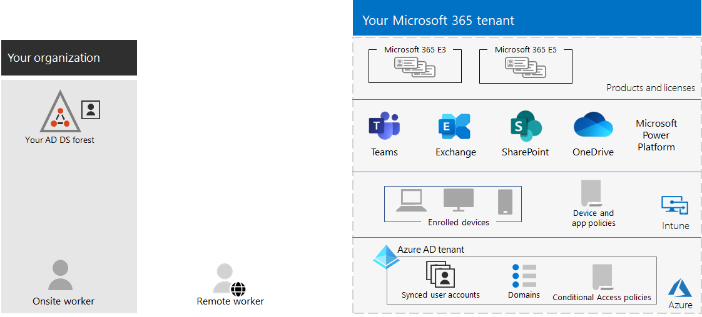

# Tenantbeheer voor Microsoft 365 voor ondernemingenTenant management for Microsoft 365 for enterprise

Voor het maken van een pad naar de digitale transformatie van uw organisatie met cloud computing is een stevige basis vereist waarop uw werknemers kunnen vertrouwen voor productiviteit, samenwerking, prestaties, privacy, compliance en beveiliging.Creating a path to your organization's digital transformation with cloud computing requires a firm foundation upon which your workers can rely for productivity, collaboration, performance, privacy, compliance, and security.

De juiste configuratie van uw Microsoft 365 tenants biedt deze basis, zodat uw werknemers zich kunnen concentreren op het doen van hun werk en op uw IT-afdeling om zich te concentreren op end-to-endoplossingen die extra bedrijfswaarde bieden.Correct configuration of your Microsoft 365 tenants provides that foundation, leaving your workers to focus on getting their work done and your IT department to focus on end-to-end solutions that provide additional business value. 

Deze oplossing neemt u mee door de configuratie van die basis in deze stappen:This solution takes you through the configuration of that foundation in these steps:

1. Uw tenants bepalenDetermine your tenants
2. Uw netwerken optimaliserenOptimize your networking
3. Uw identiteiten synchroniseren en veilige aanmeldingen afdwingenSynchronize your identities and enforce secure sign-ins
4. Uw Windows, Office clients en on-premises Office servers en gegevens migrerenMigrate your Windows devices, Office clients, and on-premises Office servers and data
5. Apparaat- en app-beheer implementerenDeploy device and app management

Maar laten we eerst even kijken wat een tenant is en hoe een tenant met een stevige basis eruitziet.But first, let's take a moment to understand what a tenant is and what a tenant that provides a firm foundation looks like.

## Een Microsoft 365 tenant gedefinieerdA Microsoft 365 tenant defined

Een Microsoft 365 tenant is een toegewezen exemplaar van de services van Microsoft 365 en uw organisatiegegevens die zijn opgeslagen op een specifieke standaardlocatie, zoals Europa of Noord-Amerika.A Microsoft 365 tenant is a dedicated instance of the services of Microsoft 365 and your organization data stored within a specific default location, such as Europe or North America. Deze locatie wordt opgegeven wanneer u de tenant voor uw organisatie maakt.This location is specified when you create the tenant for your organization. Elke Microsoft 365 tenant is afzonderlijk, uniek en gescheiden van alle andere Microsoft 365 tenants.Each Microsoft 365 tenant is distinct, unique, and separate from all other Microsoft 365 tenants. U maakt een Microsoft 365 tenant wanneer u een of meer producten bij Microsoft koopt, zoals Microsoft 365 E3 of E5, en een reeks licenties voor elk.You create a Microsoft 365 tenant when you purchase one or more products from Microsoft, such as Microsoft 365 E3 or E5, and a set of licenses for each.

Uw Microsoft 365 tenant bevat ook een Azure Active Directory (Azure AD) tenant, een speciaal exemplaar van Azure AD voor gebruikersaccounts, groepen en andere objecten.Your Microsoft 365 tenant also includes an Azure Active Directory (Azure AD) tenant, which is a dedicated instance of Azure AD for user accounts, groups, and other objects. Elke Azure AD-tenant is afzonderlijk, uniek en gescheiden van alle andere Azure AD-tenants.Each Azure AD tenant is distinct, unique, and separate from all other Azure AD tenants. Hoewel uw organisatie meerdere Azure AD-tenants kan hebben die u kunt instellen met Azure-abonnementen, kunnen Microsoft 365-tenants slechts één Azure AD-tenant gebruiken, de tenant die is gemaakt toen u de tenant maakte.While your organization can have multiple Azure AD tenants that you can set up with Azure subscriptions, Microsoft 365 tenants can only use a single Azure AD tenant, the one that was created when you created the tenant. 

Hier is een voorbeeld:Here is an example:

*Tenantbeheer* is de planning, implementatie en continue werking van uw Microsoft 365 tenants.*Tenant management* is the planning, deployment, and ongoing operation of your Microsoft 365 tenants. 

## Kenmerken van een goed ontworpen en werkende tenantAttributes of a well-designed and operating tenant

Naast de juiste naam en locatie voor uw tenant zijn er extra elementen die u kunt plannen, implementeren en beheren om ervoor te zorgen dat uw gebruikerservaringen met cloudproductiviteitsapps zoals Microsoft Teams en Exchange Online effectief, veilig en &mdash; &mdash; performant zijn.Beyond the correct name and location for your tenant, there are additional elements to plan, deploy, and manage to ensure that your user experiences with cloud productivity apps&mdash;such as Microsoft Teams and Exchange Online&mdash;are effective, secure, and performant.

Hier zijn de elementen:Here are the elements:

- U hebt de juiste set producten (abonnementen) en licenties.You have the correct set of products (subscriptions) and licenses.
  - De set producten komt overeen met uw bedrijfs-, IT- en beveiligingsbehoeften.The set of products match your business, IT, and security needs.
  - Er is een voldoende aantal licenties voor uw werknemers en verwachte wijzigingen in het personeel.There is an adequate number of licenses for your workers and anticipated changes in staffing.
- Voor netwerken:For networking:
  - U hebt de juiste DNS-domeinnamen geconfigureerd.You have configured the correct DNS domain names.
  - Voor bedrijfsnetwerken hebt u netwerkverkeer naar het Microsoft-netwerk geoptimaliseerd voor on-site werknemers.For enterprise networks, you have optimized network traffic to the Microsoft network for onsite workers.
  - U hebt netwerkverkeer geoptimaliseerd voor externe werknemers die een VPN-client gebruiken.You have optimized network traffic for remote workers who are using a VPN client.
- U hebt uw AD DS-accounts, groepen en andere objecten (Active Directory Domain Services) gesynchroniseerd.You have synchronized your Active Directory Domain Services (AD DS) accounts, groups, and other objects.
  - Uw Azure AD-tenantaccounts worden Exchange Online postvakken met de juiste DNS-domeinen voor e-mailadressen.Your Azure AD tenant accounts are mapped to Exchange Online mailboxes with the correct DNS domains for email addresses.
  - Aan uw gebruikersaccounts zijn de juiste licenties toegewezen van de juiste gekochte producten (zoals Microsoft 365 E3 of E5).Your user accounts have been assigned the correct licenses from the correct purchased products (such as Microsoft 365 E3 or E5).
- U hebt een sterke identiteits- en toegangsbeheer geconfigureerd.You have configured strong identity and access management.
  - U hebt veilige aanmelding van gebruikers nodig met wachtwoordloze of meervoudige verificatie (MFA).You are requiring secure user sign-in with passwordless or multi-factor authentication (MFA).
  - U hebt beleidsregels voor voorwaardelijke toegang die aanmeldingsvereisten en -beperkingen afdwingen voor hogere beveiligingsniveaus.You have Conditional Access policies that enforce sign-in requirements and restrictions for higher levels of security.
- On-premises Office servers en hun gegevens zijn gemigreerd naar cloud-apps of worden gebruikt in een hybride configuratie.On-premises Office servers and their data have been migrated to cloud apps or are being used in a hybrid configuration.
- U doet apparaatbeheer met Intune of Basic Mobility and Security ingebouwd in Microsoft 365.You are doing device management with Intune or Basic Mobility and Security built into Microsoft 365.
  - Uw apparaten die eigendom zijn van uw organisatie, worden geregistreerd en beheerd.Your organization-owned devices are enrolled and managed.
  - De apps voor persoonlijke apparaten worden beheerd.The apps for personal devices are managed.

Hier is een voorbeeld van een Microsoft 365 tenant met al deze elementen op zijn plaats.Here is an example of a Microsoft 365 tenant with all these elements in place.

In deze afbeelding bevat de Microsoft 365 tenant:In this illustration, the Microsoft 365 tenant includes:

- Producten en licenties voor Microsoft 365 E3 en E5.Products and licenses for Microsoft 365 E3 and E5.
- Microsoft 365 productiviteits-apps.Microsoft 365 productivity apps.
- Intune met geregistreerde apparaten en apparaat- en toepassingsbeleid.Intune with enrolled devices and device and application policies.
- Een Azure AD-tenant met gesynchroniseerd gebruikersaccount (groepen en andere adreslijstobjecten worden niet weergegeven), domeinen en beleid voor voorwaardelijke toegang.An Azure AD tenant that has synchronized user account (groups and other directory objects are not shown), domains, and Conditional Access policies.

## Tenantmogelijkheden voor Microsoft 365 voor bedrijvenTenant capabilities for Microsoft 365 for enterprise

In de volgende secties en tabel worden de belangrijkste mogelijkheden en licenties vermeld voor de stappen in deze oplossing.The following sections and table list the key capabilities and licensing for the steps in this solution.

### TenantTenant

| FunctieCapability or feature | BeschrijvingDescription | LicentiesLicensing |
|:-------|:-----|:-------|
| Meerdere tenantsMultiple tenants | Elke Microsoft 365 tenant is afzonderlijk, uniek en gescheiden van alle andere Microsoft 365 tenants.Each Microsoft 365 tenant is distinct, unique, and separate from all other Microsoft 365 tenants. Bij meerdere tenants zijn er beperkingen en extra aandachtspunten bij het beheren van deze tenants en het leveren van services aan uw gebruikers.With multiple tenants, there are restrictions and additional considerations when managing them and providing services to your users. | Microsoft 365 E3 of E5Microsoft 365 E3 or E5 | 
| Migratie van postvakken tussen tenantsCross-tenant mailbox migration | Tenantbeheerders kunnen postvakken verplaatsen tussen tenants met minimale infrastructuurafhankelijkheden in hun on-premises systemen.Tenant administrators can move mailboxes between tenants with minimal infrastructure dependencies in their on-premises systems. Hierdoor hoeft u geen postvakken aan boord of aan boord meer te gebruiken.This removes the need to off-board and onboard mailboxes. | Microsoft 365 E3 of E5Microsoft 365 E3 or E5 | 
| Multi-GeoMulti-Geo | Uw tenant kan gegevens in rust opslaan in de andere geografische datacenterlocaties die u hebt gekozen om te voldoen aan de vereisten voor gegevensopslag.Your tenant can store data at rest in the other datacenter geo locations that you've chosen to meet data residency requirements. | Microsoft 365 E3 of E5Microsoft 365 E3 or E5 | 
| Kerngegevens verplaatsen naar een nieuw datacenterMove core data to a new datacenter geo | Wanneer Microsoft nieuwe datacentergeo's toevoegt voor extra capaciteits- en rekenbronnen, kunt u een geovernieuwing voor datacenters aanvragen voor in-geogegevens voor uw kerngegevens.As Microsoft adds new datacenter geos for additional capacity and compute resources, you can request a datacenter geo move for in-geo data residency for your core customer data. | Microsoft 365 E3 of E5Microsoft 365 E3 or E5 | 
||||

### NetwerkenNetworking

| FunctieCapability or feature | BeschrijvingDescription | LicentiesLicensing |
|:-------|:-----|:-------|
| NetwerkinzichtenNetwork Insights | Meetgegevens voor netwerkprestaties die zijn verzameld Microsoft 365 tenant om u te helpen bij het ontwerpen van netwerkperimeters voor uw kantoorlocaties.Network performance metrics collected from your Microsoft 365 tenant to help you design network perimeters for your office locations. | Microsoft 365 E3 of E5Microsoft 365 E3 or E5 | 
| Endpoint-updates automatiserenAutomate endpoint updates | Automatiseer de configuratie en doorlopende updates voor Microsoft 365 eindpunten in uw CLIENT PAC-bestanden en netwerkapparaten en -services.Automate the configuration and ongoing updates for Microsoft 365 endpoints in your client PAC files and network devices and services. | Microsoft 365 E3 of E5Microsoft 365 E3 or E5 | 
||||

### IdentiteitIdentity

| FunctieCapability or feature | BeschrijvingDescription | LicentiesLicensing |
|:-------|:-----|:-------|
| On-premises Active Directory Domain Services (AD DS) synchroniseren met uw Azure AD-tenantSynchronize on-premises Active Directory Domain Services (AD DS) with your Azure AD tenant    | Maak gebruik van uw on-premises identiteitsprovider voor gebruikersaccounts, groepen en andere objecten.Leverage your on-premises identity provider for user accounts, groups, and other objects. | Microsoft 365 E3 of E5Microsoft 365 E3 or E5 |
| Afgedwongen door MFA en met standaardbeveiligingsinstellingenMFA enforced with security defaults   | Voorkom gecompromitteerde identiteiten en apparaten met een tweede vorm van verificatie voor aanmeldingen. Als standaardinstelling voor de beveiliging is MFA vereist voor alle gebruikersaccounts.Protect against compromised identities and devices by requiring a second form of authentication for sign-ins. Security defaults requires MFA for all user accounts.   | Microsoft 365 E3 of E5Microsoft 365 E3 or E5 |
| Afgedwongen door MFA en met voorwaardelijke toegangMFA enforced with Conditional Access| Vereist MFA op basis van de kenmerken van de aanmelding met beleid voor voorwaardelijke toegang.Require MFA based on the attributes of the sign-in with Conditional Access policies.    | Microsoft 365 E3 of E5Microsoft 365 E3 or E5 | 
| Afgedwongen door MFA en met voorwaardelijke toegang op basis van risicoMFA enforced with risk-based Conditional Access   | Vereis MFA op basis van het risico van de gebruikersaanmelding met Microsoft Defender for Identity.Require MFA based on the risk of the user sign-in with Microsoft Defender for Identity. | Microsoft 365 E5 of E3 met Azure AD Premium P2-licentiesMicrosoft 365 E5 or E3 with Azure AD Premium P2 licenses | 
| Selfservice voor wachtwoordherstel (SSPR)Self-Service Password Reset (SSPR)    | Sta toe dat gebruikers hun wachtwoorden of accounts opnieuw kunnen instellen of ontgrendelen.Allow your users to reset or unlock their passwords or accounts.  | Microsoft 365 E3 of E5Microsoft 365 E3 or E5 |
||||

### MigratieMigration

| FunctieCapability or feature | BeschrijvingDescription | LicentiesLicensing |
|:-------|:-----|:-------|
| Migreren naar Windows 10Migrate to Windows 10 | Migreert uw apparaten met Windows 7 of Windows 8.1 naar Windows 10 Enterprise.Migrate your devices that run Windows 7 or Windows 8.1 to Windows 10 Enterprise. | Windows 10 Enterprise licenties die zijn inbegrepen bij Microsoft 365 E3 of E5Windows 10 Enterprise licenses included with Microsoft 365 E3 or E5 | 
| Migreren naar Microsoft 365-apps voor ondernemingenMigrate to Microsoft 365 Apps for enterprise | Migreert Office client-apps zoals Word en PowerPoint naar de versies die zijn geïnstalleerd vanuit de cloud die worden bijgewerkt met nieuwe functies.Migrate your Office client apps such as Word and PowerPoint to the versions installed from the cloud that are updated with new features. | Microsoft 365 E3 of E5Microsoft 365 E3 or E5 | 
| On-premises servers en gegevens migreren naar Microsoft 365Migrate on-premises servers and data to Microsoft 365 | Migreert Exchange postvakken, SharePoint sites en Skype voor Bedrijven Online naar Microsoft 365 cloudservices.Migrate your Exchange mailboxes, SharePoint sites, and Skype for Business Online to Microsoft 365 cloud services. | Microsoft 365 E3 of E5Microsoft 365 E3 or E5 | 
||||

### Apparaat- en app-beheerDevice and app management

| FunctieCapability or feature | BeschrijvingDescription | LicentiesLicensing |
|:-------|:-----|:-------|
| Microsoft IntuneMicrosoft Intune | Een cloudservice die MDM (Mobile Device Management) en MOBILE Application Management (MAM) biedt om te bepalen hoe de toepassing van uw organisatie en de apparaten worden gebruikt, inclusief mobiele telefoons, tablets en laptops.A cloud-based service that provides mobile device management (MDM) and mobile application management (MAM) to control how your organization’s application and the devices are used, including mobile phones, tablets, and laptops. | Microsoft 365 E3 of E5Microsoft 365 E3 or E5 | 
| Basic Mobility en SecurityBasic Mobility and Security | Beveilig en beheer de mobiele apparaten van uw gebruikers, zoals iPhones, iPads, Androids en Windows met deze ingebouwde service.Secure and manage your users' mobile devices like iPhones, iPads, Androids, and Windows phones with this built-in service.  | Microsoft 365 E3 of E5Microsoft 365 E3 or E5 | 
||||

## Volgende stappenNext steps

Gebruik deze stappen om uw tenants in te stellen en Microsoft 365 beheren.Use these steps to set up and manage your Microsoft 365 tenants.

1. [Uw tenants bepalenDetermine your tenants](tenant-management-tenants.md)
2. [Uw netwerken optimaliserenOptimize your networking](tenant-management-networking.md)
3. [Uw identiteiten synchroniseren en veilige aanmeldingen afdwingenSynchronize your identities and enforce secure sign-ins](tenant-management-identity.md)
4. [Uw on-premises Office servers en gegevens migrerenMigrate your on-premises Office servers and data](tenant-management-migration.md)
5. [Apparaat- en app-beheer implementerenDeploy device and app management](tenant-management-device-management.md)

In elke stap worden implementatieopties beschreven, worden de resultaten en de lopende onderhoudstaken samengevat.Each step describes deployment options, summarizes the results, and ongoing maintenance tasks.

Zie de [contoso-case study](../enterprise/contoso-case-study.md)om te begrijpen hoe een fictieve, maar representatieve multi-nationale organisatie de elementen van hun Microsoft 365 heeft geïmplementeerd.To understand how a fictional but representative multi-national organization deployed the elements of their Microsoft 365 tenant, see the [Contoso case study](../enterprise/contoso-case-study.md).
