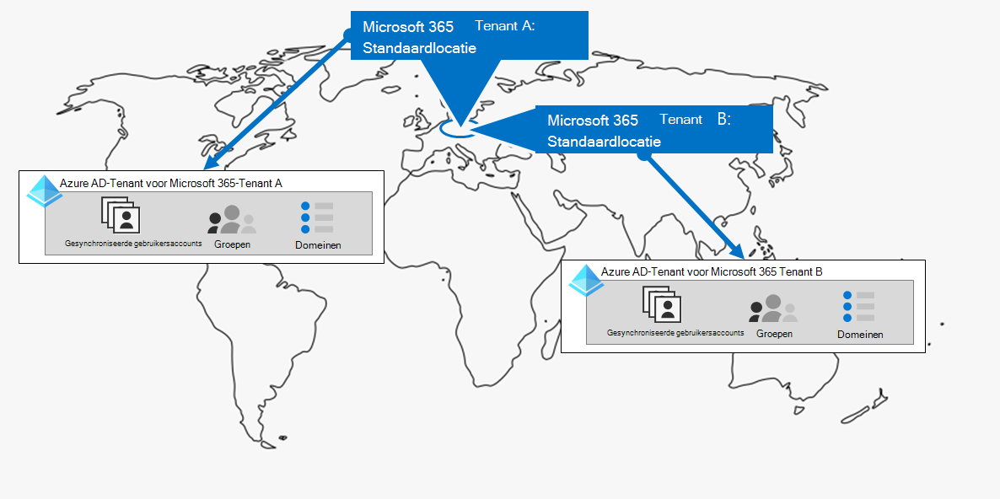
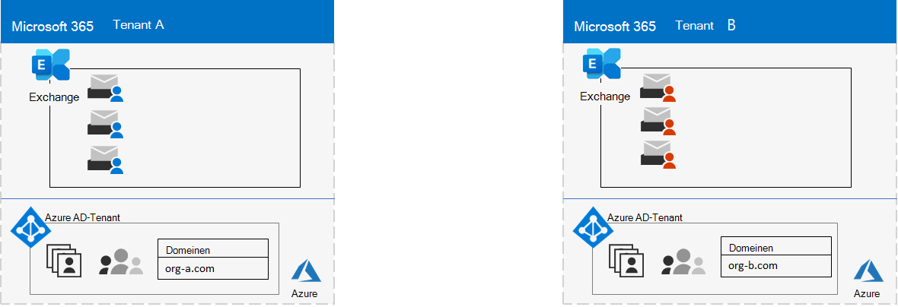
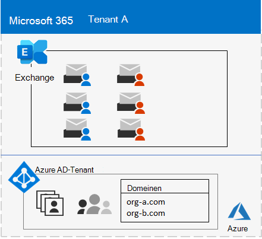

# Stap 1. Uw Microsoft 365 for Enterprise-tenants

Een van uw eerste Tenant beslissingen is wat u moet hebben. Elke Microsoft 365-Tenant is DISTINCT, Unique en los van alle andere Microsoft 365-tenants. De bijbehorende Azure AD-Tenant is ook uniek en apart van alle andere Microsoft 365-tenants.

## Eén Tenant
Als u één Tenant gebruikt, worden veel aspecten van het gebruik van Microsoft 365 eenvoudiger. Eén Tenant betekent één Azure AD-Tenant met één set accounts, groepen en beleidsregels. U kunt de machtigingen voor het delen van bronnen in uw organisatie via deze centrale identiteitsprovider doen.

Eén Tenant biedt de meeste functies-rijke en vereenvoudigde samenwerking en productiviteits ervaring voor uw gebruikers.

Hier ziet u een voorbeeld met de standaardlocatie en de Azure AD-Tenant van een Microsoft 365-Tenant.

## Meerdere tenants

Er zijn verschillende redenen waarom uw organisatie meerdere tenants heeft:

- Beheerders isolatie
- Gecentraliseerd
- Historische beslissingen
- Samenvoegbewerkingen, acquisities of divestitures
- Scheiding van huisstijl voor conglomeraat organisaties wissen
- Voorbereidingen voor productie, testen of sandbox-tenants

Hier ziet u een voorbeeld van een organisatie met twee tenants (Tenant A en Tenant B) in hetzelfde standaardgebied geo. Elke Tenant als afzonderlijke Azure AD-Tenant.

Wanneer er meerdere tenants zijn, gelden er beperkingen en aanvullende aandachtspunten wanneer u ze beheert en services levert voor uw gebruikers.

### Samenwerking tussen verschillende tenants

Als u wilt dat uw gebruikers effectiever samenwerken in verschillende Microsoft 365-tenants op een veilige manier, kunt u gebruikmaken van een centrale locatie voor het delen van bestanden en gesprekken, agenda's delen, met behulp van CHATBERICHTEN, audio/video bellen en het beveiligen van toegang tot bronnen en toepassingen.

Zie [samenwerken via Microsoft 365 tussen tenants](../enterprise/microsoft-365-inter-tenant-collaboration.md)voor meer informatie.

### Migratie van cross-Tenant postvak (preview)

Voordat u Exchange Online-postvakken tussen tenants verplaatst, moet u, voordat u migratie van cross-tenants migreert, volledig verwijderen van de huidige Tenant (de bron Tenant) naar on-premises en ze vervolgens op een nieuwe Tenant (de doel Tenant) plaatsen. Met de nieuwe functie voor het migreren van postvakken kunnen tenantbeheerders van de bron-en doel tenants postvakken verplaatsen tussen de tenants met minimale infrastructuur afhankelijkheden in hun on-premises systemen. Hiermee verwijdert u de postvakken die u niet nodig hebt.

Hieronder vindt u twee voorbeelden van tenants en hun postvakken vóór migratie van postvakken van cross tenants.

In deze afbeelding hebben twee afzonderlijke tenants eigen domeinen en set Exchange-postvakken.

Dit is de doel Tenant (Tenant A) na migratie van cross-Tenant berichten.

In deze afbeelding heeft één Tenant beide domeinen en beide sets Exchange-postvakken.

Zie voor meer informatie [migratie van migratie](../enterprise/cross-tenant-mailbox-migration.md)via een Tenant.

### Tenant-naar-tenant-migraties

Er zijn diverse architecturale benaderingen voor fusies, verwervingen, divestitures en andere scenario's waarmee u een bestaande Microsoft 365-Tenant kunt migreren naar een nieuwe Tenant. 

Zie [Microsoft 365 Tenant-to-Tenant-migraties](../enterprise/microsoft-365-tenant-to-tenant-migrations.md)voor uitgebreide informatie.

## Meerdere geografische voor een Tenant

Met Microsoft 365 in Microsoft kunt u gegevens op de rest van de andere datacenter geo-locaties inrichten en bewaren die u hebt gekozen om te voldoen aan de vereisten voor gegevens woonplaats en tegelijk de wereldwijde implementatie van de moderne productiviteits ervaringen met uw werknemers ontgrendelen.

In een omgeving met meerdere geografische locaties bestaat uw Microsoft 365-Tenant uit een standaard-of centrale locatie waar uw Microsoft 365-abonnement oorspronkelijk is gemaakt en een of meer satelliet locaties. In een Tenant met meerdere geo-gebruikers is de informatie over geo-locaties, groepen en gebruikers informatie gemastereerd in een wereldwijde Azure AD-Tenant. Aangezien uw Tenant gegevens centraal worden gemigreerd en op elke geografische locatie worden gesynchroniseerd, worden de samenwerking van gebruikers die zich in uw bedrijf bevinden, via de locaties gedeeld.

Hier ziet u een voorbeeld van een organisatie met de standaardlocatie in Europe en de vestiging van een satelliet in Noord-Amerika. Beide locaties delen dezelfde wereldwijde Azure AD-Tenant voor de afzonderlijke Microsoft 365-Tenant.

Zie [Microsoft 365 multi-geo](../enterprise/microsoft-365-multi-geo.md)voor meer informatie.

## Kerngegevens verplaatsen naar een nieuw datacenter-geo

Microsoft gaat verder met het openen van nieuwe datacenter GEOS voor Microsoft 365-Services. Met deze nieuwe datacenter-GEOS kunt u capaciteit en de berekenings bronnen voor onze aanhoudende klantvraag en gebruiks groei toevoegen. Daarnaast biedt de nieuwe datacenter GEOS een in-geo data woonplaats voor de primaire klantgegevens.

Hoewel het openen van een nieuw datacenter geo geen invloed heeft op uw gegevens en de kerngegevens die zijn opgeslagen in een al bestaand datacenter, is Microsoft u in staat een vroegtijdige migratie van de kern klantgegevens van uw organisatie bij elkaar te betrekken voor een nieuw datacenter-geo.

Hier ziet u een voorbeeld waarin een Microsoft 365-Tenant van de Europese Unie (EU) datacenter naar de naam van het Verenigd Koninkrijk (VK) is geplaatst.

Zie [Core Data verplaatsen naar nieuwe Microsoft 365 datacenter GEOS](../enterprise/moving-data-to-new-datacenter-geos.md)voor meer informatie.

## Producten en licenties voor een Tenant

Uw Microsoft 365-Tenant wordt gemaakt wanneer u uw eerste product koopt, zoals Microsoft 365 E3. Samen met het product zijn licenties, dat maandelijks of jaarlijks kosten in rekening worden gebracht. Een beheerder wijst vervolgens een beschikbare licentie van een van uw producten toe aan een gebruikersaccount, hetzij direct of via groepslidmaatschap. Afhankelijk van de bedrijfsbehoeften van uw organisatie, hebt u mogelijk een set producten, elk met een eigen groep licenties. 

Het bepalen van de set producten en het aantal licenties waarvoor elke planning moet worden gepland:

- Zorg ervoor dat er voldoende licenties zijn voor de gebruikersaccounts waarvoor u geavanceerde functies nodig hebt.
- Hiermee kunt u voorkomen dat licenties worden uitgevoerd of te veel niet-toegewezen licenties zijn, op basis van wijzigingen in het personeel van uw organisatie.

## Resultaten van stap 1

Voor uw Microsoft 365 for Enterprise-tenants hebt u het volgende vastgesteld:

- Hoeveel tenants u hebt of nodig hebt.
- U moet voor iedere Tenant de producten en licenties aanschaffen.
- Of een Tenant moet meerdere geo moet zijn om te voldoen aan de vereisten voor data-woonplaats.
- Of u de samenwerking tussen tenants moet instellen.
- Of u één Tenant naar een andere Tenant moet migreren.
- Of u de kerngegevens van een datacenter naar een andere datacenter moet verplaatsen.

Hier ziet u een voorbeeld van een nieuwe Tenant.

In deze afbeelding is de Tenant:

- Een standaardlocatie die overeenstemt met een Microsoft 365 datacenter geo.
- Een reeks producten en licenties.
- De set Cloud productiviteitstoepassingen, waarvan sommige specifiek zijn voor producten.
- Een Azure AD-Tenant die globale beheerdersaccounts en een initiële DNS-domeinnaam bevat.

Wanneer we de extra stappen van deze oplossing doorlopen, wordt deze afbeelding opgebouwd.

## Voortdurende onderhoud voor tenants

Het kan zijn dat u het volgende moet doen:

- Een nieuwe Tenant toevoegen.
- Voeg nieuwe producten toe aan een Tenant met een initieel aantal licenties.
- Wijzig de reeks licenties voor een product in een Tenant zodat u deze kunt aanpassen aan de vereisten voor het wijzigen van de werknemer.
- Verplaats uw kerngegevens van een Tenant naar een nieuwe datacenter-geografische locatie.
- Voeg een meervoudige geo voor de woonplaats-vereisten voor data.
- Samenwerking tussen tenants instellen.

## Volgende stap

Ga verder met [netwerken](tenant-management-networking.md) om optimaal netwerk van uw werknemers in te stellen voor microsoft 365-cloudservices.
