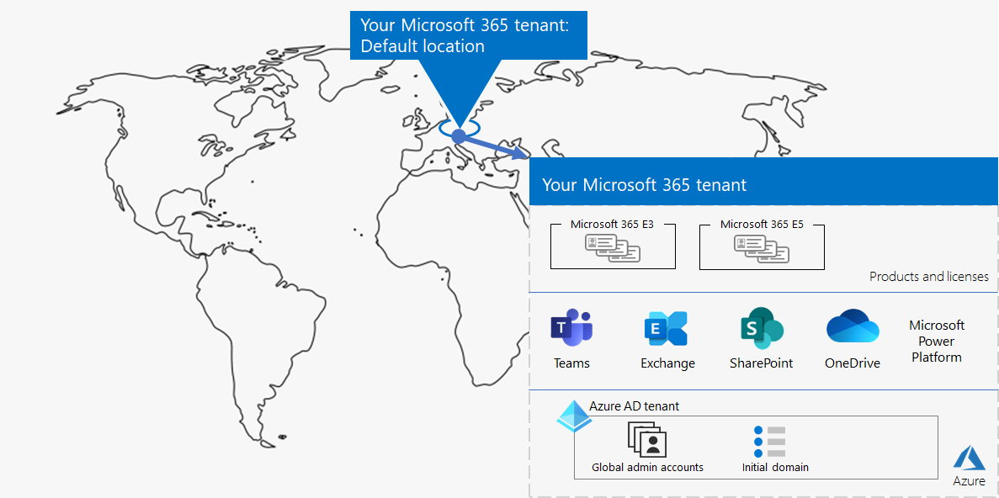

# Stap 1. Uw Microsoft 365 voor zakelijke tenants

Een van uw eerste tenantbeslissingen is hoeveel u moet hebben. Elke Microsoft 365 tenant is afzonderlijk, uniek en gescheiden van alle andere Microsoft 365 tenants. De bijbehorende Azure AD-tenant is ook verschillend, uniek en gescheiden van alle andere Microsoft 365 tenants.

## Eén tenant
Als u één tenant hebt, worden veel aspecten van het gebruik van Microsoft 365. Eén tenant betekent één Azure AD-tenant met één set accounts, groepen en beleidsregels. Machtigingen en het delen van resources binnen uw organisatie kunnen worden uitgevoerd via deze centrale identiteitsprovider.

Eén tenant biedt de meest uitgebreide en vereenvoudigde samenwerkings- en productiviteitservaring voor uw gebruikers.

Hier is een voorbeeld met de standaardlocatie en Azure AD-tenant van een Microsoft 365 tenant.

## Meerdere tenants

Er zijn veel redenen waarom uw organisatie meerdere tenants kan hebben:

- Beheerisolatie
- Gedecentraliseerde IT
- Historische beslissingen
- Fusies, overnames of afstotingen
- Duidelijke scheiding van huisstijl voor conglomeraatorganisaties
- Pre-productie-, test- of sandbox-tenants

Hier is een voorbeeld van een organisatie die twee tenants (Tenant A en Tenant B) in hetzelfde standaardcentrum geo heeft. Elke tenant als afzonderlijke Azure AD-tenant.

Wanneer u meerdere tenants hebt, zijn er beperkingen en extra aandachtspunten bij het beheren van deze tenants en het leveren van services aan uw gebruikers.

### Samenwerking tussen verschillende tenants

Als u wilt dat uw gebruikers effectiever samenwerken in verschillende Microsoft 365-tenants op een veilige manier, zijn samenwerkingsopties tussen tenants onder andere het gebruik van een centrale locatie voor bestanden en gesprekken, het delen van agenda's, het gebruik van chatberichten, audio-/videogesprekken voor communicatie en het beveiligen van toegang tot resources en toepassingen.

Zie voor meer informatie [Microsoft 365 samenwerking tussen tenants](../enterprise/microsoft-365-inter-tenant-collaboration.md).

### Migratie van postvakken tussen tenants (voorbeeld)

Vóór de migratie van een postvak met verschillende tenants (in voorbeeld), moet u bij het verplaatsen van Exchange Online-postvakken tussen tenants een gebruikerspostvak volledig van hun huidige tenant (de brontender) naar on-premises verplaatsen en deze vervolgens aan boord brengen bij een nieuwe tenant (de doelten tenant). Met de nieuwe functie voor migratie van postvakken tussen tenants kunnen tenantbeheerders in zowel bron- als doelten tenants postvakken verplaatsen tussen de tenants met minimale infrastructuurafhankelijkheden in hun on-premises systemen. Hierdoor hoeft u geen postvakken aan boord of aan boord meer te gebruiken.

Hier volgen twee voorbeeldtententen en hun postvakken vóór de migratie van het postvak tussen tenants.

In deze afbeelding hebben twee afzonderlijke tenants hun eigen domeinen en set Exchange postvakken.

Hier is de doel tenant (Tenant A) na de migratie van het postvak tussen tenants.

In deze afbeelding heeft één tenant zowel domeinen als beide sets Exchange postvakken.

Zie Migratie van postvakken [met meerdere tenants voor meer informatie.](../enterprise/cross-tenant-mailbox-migration.md)

### Tenant-naar-tenant-migraties

Er zijn verschillende architectuurbenaderingen voor fusies, overnames, afstotingen en andere scenario's die ertoe kunnen leiden dat u een bestaande Microsoft 365 tenant naar een nieuwe tenant migreert. 

Zie voor gedetailleerde richtlijnen [Microsoft 365 tenant-to-tenant-migraties](../enterprise/microsoft-365-tenant-to-tenant-migrations.md).

## Multi-Geo voor een tenant

Met Microsoft 365 Multi-Geo kunt u gegevens inrichten en opslaan in de overige datacenterlocaties die u hebt gekozen om te voldoen aan de vereisten voor gegevensopslag en tegelijkertijd uw globale implementatie van moderne productiviteitservaringen voor uw werknemers ontgrendelen.

In een Multi-Geo-omgeving bestaat Microsoft 365 tenant uit een standaard- of centrale locatie waar uw Microsoft 365 oorspronkelijk is gemaakt en een of meer satellietlocaties. In een multi-geo tenant wordt de informatie over geografische locaties, groepen en gebruikersgegevens beheerst in een globale Azure AD-tenant. Omdat uw tenantgegevens centraal worden gemodelleerd en gesynchroniseerd naar elke geografische locatie, worden samenwerkingservaringen met iedereen uit uw bedrijf gedeeld over de locaties.

Hier is een voorbeeld van een organisatie met de standaardlocatie in Europa en een satellietlocatie in Noord-Amerika. Beide locaties delen dezelfde globale Azure AD-tenant voor de Microsoft 365 tenant.

Zie [Microsoft 365 Multi-Geo](../enterprise/microsoft-365-multi-geo.md) voor meer informatie.

## Kerngegevens verplaatsen naar een nieuw datacenter

Microsoft blijft nieuwe datacenter-geo's openen voor Microsoft 365 services. Deze nieuwe datacenter-geo's voegen capaciteits- en rekenbronnen toe om onze continue klantvraag en gebruiksgroei te ondersteunen. Bovendien bieden de nieuwe datacentergeo's in-geogegevenslocatie voor basisgegevens van klanten.

Hoewel het openen van een nieuw datacenter-geo geen invloed heeft op u en uw kerngegevens die zijn opgeslagen in een al bestaande datacenter-geo, kunt u met Microsoft een vroegtijdige migratie aanvragen van de kernklantgegevens van uw organisatie in rust naar een nieuw datacenter-geo.

Hier is een voorbeeld waarin een Microsoft 365 is verplaatst van het datacenter geo van de Europese Unie (EU) naar het datacenter in het Verenigd Koninkrijk (VK).

Zie Kerngegevens verplaatsen [naar nieuwe Microsoft 365 datacenter geos voor meer informatie.](../enterprise/moving-data-to-new-datacenter-geos.md)

## Producten en licenties voor een tenant

Uw Microsoft 365 wordt gemaakt wanneer u uw eerste product koopt, zoals Microsoft 365 E3. Naast het product zijn er licenties, die maandelijks of jaarlijks in rekening worden gebracht. Een beheerder wijst vervolgens een beschikbare licentie van een van uw producten toe aan een gebruikersaccount, rechtstreeks of via groepslidmaatschap. Afhankelijk van de zakelijke behoeften van uw organisatie, hebt u mogelijk een set producten, elk met een eigen groep licenties. 

Voor het bepalen van de set producten en het aantal licenties voor elk product is een planning vereist:

- Zorg ervoor dat u voldoende licenties hebt voor de gebruikersaccounts die geavanceerde functies nodig hebben.
- Voorkom dat u geen licenties meer hebt of te veel niet-toegewezen licenties hebt, op basis van wijzigingen in de personeelsbeplaatsing in uw organisatie.

## Resultaten van stap 1

Voor uw Microsoft 365 voor zakelijke tenants hebt u het volgende bepaald:

- Hoeveel tenants u hebt of nodig hebt.
- Voor elke tenant, welke producten en licenties moeten worden gekocht.
- Of een tenant Multi-Geo moet zijn om te voldoen aan de vereisten voor gegevenslocatie.
- Of u samenwerking tussen tenants moet instellen.
- Of u de ene tenant naar een andere wilt migreren.
- Of u kerngegevens van het ene datacenter naar het andere wilt verplaatsen.

Hier is een voorbeeld van een nieuwe tenant.

In deze afbeelding heeft de tenant:

- Een standaardlocatie die overeenkomt met een Microsoft 365 datacenter geo.
- Een set producten en licenties.
- De set cloudproductiviteits-apps, waarvan sommige specifiek zijn voor producten.
- Een Azure AD-tenant met globale beheerdersaccounts en een oorspronkelijke DNS-domeinnaam.

Terwijl we de aanvullende stappen van deze oplossing doorlopen, wordt dit cijfer verder opgebouwd.

## Doorlopend onderhoud voor tenants

Op permanente basis moet u mogelijk het volgende doen:

- Een nieuwe tenant toevoegen.
- Voeg nieuwe producten toe aan een tenant met een eerste aantal licenties.
- Wijzig de set licenties voor een product in een tenant om de personeelsvereisten aan te passen.
- Verplaats de kerngegevens van een tenant naar een nieuwe datacenterlocatie.
- Voeg Multi-Geo toe voor vereisten voor gegevenslocatie.
- Samenwerking tussen tenants instellen.

## Volgende stap

Ga door [met netwerken](tenant-management-networking.md) om optimaal te netwerken van uw werknemers tot Microsoft 365 cloudservices.
