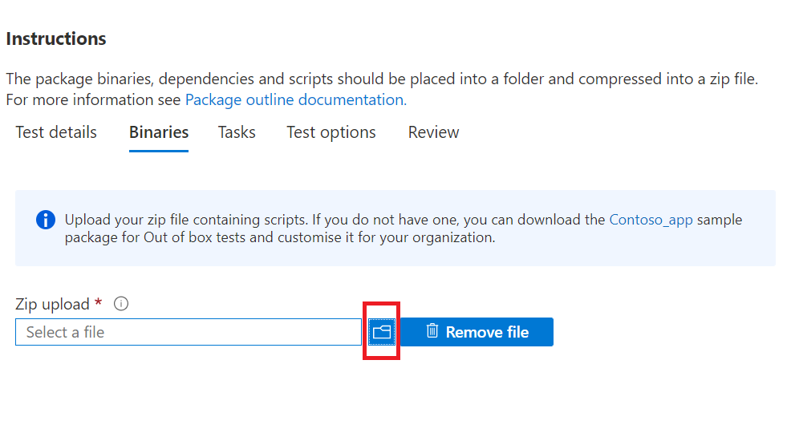

# <a name="step-3-upload-your-binaries-dependencies-and-scripts"></a>Stap 3: Upload, afhankelijkheden en scripts

Op dit tabblad uploadt u één zip-pakket met uw binaries, afhankelijkheden en scripts die worden gebruikt om uw testsuite uit te voeren.

## <a name="upload-package-zip-file"></a>Upload pakket zip-bestand



  - Geüploade afhankelijkheden kunnen testkaders, scripting-engines of gegevens bevatten die worden gebruikt om uw toepassing of test cases uit te voeren. U kunt bijvoorbeeld Selenium en een webdriver-installatieprogramma uploaden om browsertests uit te voeren.
  - Het is de beste manier om ervoor te zorgen dat uw scriptactiviteiten modulair worden bewaard, dat wil zeggen. 
    - Het ```Install``` script voert alleen installatiebewerkingen uit.
    - Het ```Launch``` script start alleen de toepassing.
    - Het ```Close``` script sluit alleen de toepassing.
    - Met het ```Uninstall``` optionele script wordt de toepassing alleen verwijderd.

**Op dit moment ondersteunt de portal alleen PowerShell-scripts.**


## <a name="next-steps"></a>Volgende stappen 

Ga naar het volgende artikel om naar stap 4 te gaan: **Uw testtaken instellen.**
> [!div class="nextstepaction"]
> [Terug](uploadApplication.md)
> [!div class="nextstepaction"]
> [Volgende stap](testtask.md)

