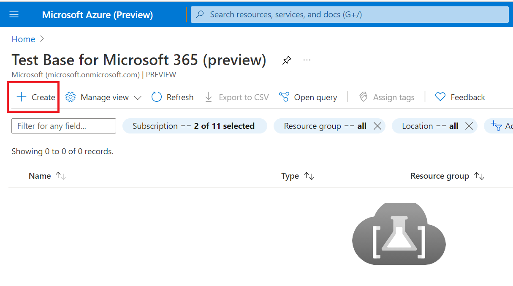

# <a name="step-1-create-a-test-base-account"></a><span data-ttu-id="c4d6b-103">Stap 1: Een Test Base-account maken</span><span class="sxs-lookup"><span data-stu-id="c4d6b-103">Step 1: Create a Test Base account</span></span>

<span data-ttu-id="c4d6b-104">Als u geen Azure-abonnement hebt, maakt u een [gratis account](https://azure.microsoft.com/en-us/free/) voordat u begint.</span><span class="sxs-lookup"><span data-stu-id="c4d6b-104">If you don't have an Azure subscription, create a [free account](https://azure.microsoft.com/en-us/free/) before you begin.</span></span>

## <a name="enter-details-for-test-base-account"></a><span data-ttu-id="c4d6b-105">Details invoeren voor testbasisaccount</span><span class="sxs-lookup"><span data-stu-id="c4d6b-105">Enter details for test base account</span></span>
 
1. <span data-ttu-id="c4d6b-106">Zoek naar **'Test Base'** in de Azure-portal.</span><span class="sxs-lookup"><span data-stu-id="c4d6b-106">Search for **'Test Base'** in the Azure portal.</span></span>


2. <span data-ttu-id="c4d6b-108">Klik **op Toevoegen om** een Test Base-account te maken.</span><span class="sxs-lookup"><span data-stu-id="c4d6b-108">Click **'Add'** to create a Test Base account.</span></span>



3.  <span data-ttu-id="c4d6b-110">Lees het selectievakje door om te bevestigen dat u ```Terms of Use``` tevreden was met de ```Terms of Use``` .</span><span class="sxs-lookup"><span data-stu-id="c4d6b-110">Read through the ```Terms of Use``` then select the checkbox to confirm your satisfaction with the ```Terms of Use```.</span></span>


4.  <span data-ttu-id="c4d6b-112">Vul onder de volgende vereisten de juiste informatie in:</span><span class="sxs-lookup"><span data-stu-id="c4d6b-112">Fill in the correct information under the following requirements:</span></span> 
    -   <span data-ttu-id="c4d6b-113">Abonnement: Resourcegroep</span><span class="sxs-lookup"><span data-stu-id="c4d6b-113">Subscription: Resource Group</span></span>
    -   <span data-ttu-id="c4d6b-114">Exemplaardetails: Naam.</span><span class="sxs-lookup"><span data-stu-id="c4d6b-114">Instance Details: Name.</span></span>

<span data-ttu-id="c4d6b-115">**Test Base ondersteunt momenteel alleen de laag Standaardprijzen.**</span><span class="sxs-lookup"><span data-stu-id="c4d6b-115">**Currently, Test Base only supports Standard Pricing tier.**</span></span>


5.  <span data-ttu-id="c4d6b-117">Klik ten slotte op om ```Review + Create``` uw nieuw gemaakte account te valideren en in te stellen.</span><span class="sxs-lookup"><span data-stu-id="c4d6b-117">Finally, click on ```Review + Create``` to validate and enable your newly created account.</span></span>

## <a name="next-steps"></a><span data-ttu-id="c4d6b-118">Volgende stappen</span><span class="sxs-lookup"><span data-stu-id="c4d6b-118">Next steps</span></span>

<span data-ttu-id="c4d6b-119">Ga naar het volgende artikel om aan de slag te gaan met Stap 2: **Meer informatie over het uploaden van uw pakket.**</span><span class="sxs-lookup"><span data-stu-id="c4d6b-119">Advance to the next article to get started with Step 2: **Learn how upload your package.**</span></span>
> [!div class="nextstepaction"]
> [<span data-ttu-id="c4d6b-120">Volgende stap</span><span class="sxs-lookup"><span data-stu-id="c4d6b-120">Next step</span></span>](uploadApplication.md)

<!---
Add button for next page
-->
