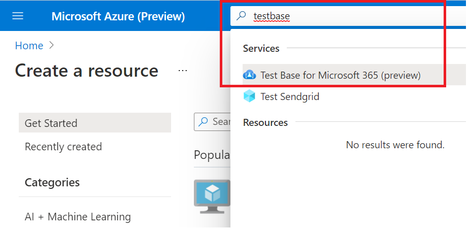

# <a name="step-1-create-a-test-base-account"></a>Stap 1: Een Test Base-account maken

Als u geen Azure-abonnement hebt, maakt u een [gratis account](https://azure.microsoft.com/en-us/free/) voordat u begint.

## <a name="enter-details-for-test-base-account"></a>Details invoeren voor testbasisaccount
 
1. Zoek naar **'Test Base'** in de Azure-portal.



2. Klik **op Toevoegen om** een Test Base-account te maken.


3.  Lees het selectievakje door om te bevestigen dat u ```Terms of Use``` tevreden was met de ```Terms of Use``` .


4.  Vul onder de volgende vereisten de juiste informatie in: 
    -   Abonnement: Resourcegroep
    -   Exemplaardetails: Naam.

**Test Base ondersteunt momenteel alleen de laag Standaardprijzen.**


5.  Klik ten slotte op om ```Review + Create``` uw nieuw gemaakte account te valideren en in te stellen.

## <a name="next-steps"></a>Volgende stappen

Ga naar het volgende artikel om aan de slag te gaan met Stap 2: **Meer informatie over het uploaden van uw pakket.**
> [!div class="nextstepaction"]
> [Volgende stap](uploadApplication.md)

<!---
Add button for next page
-->
