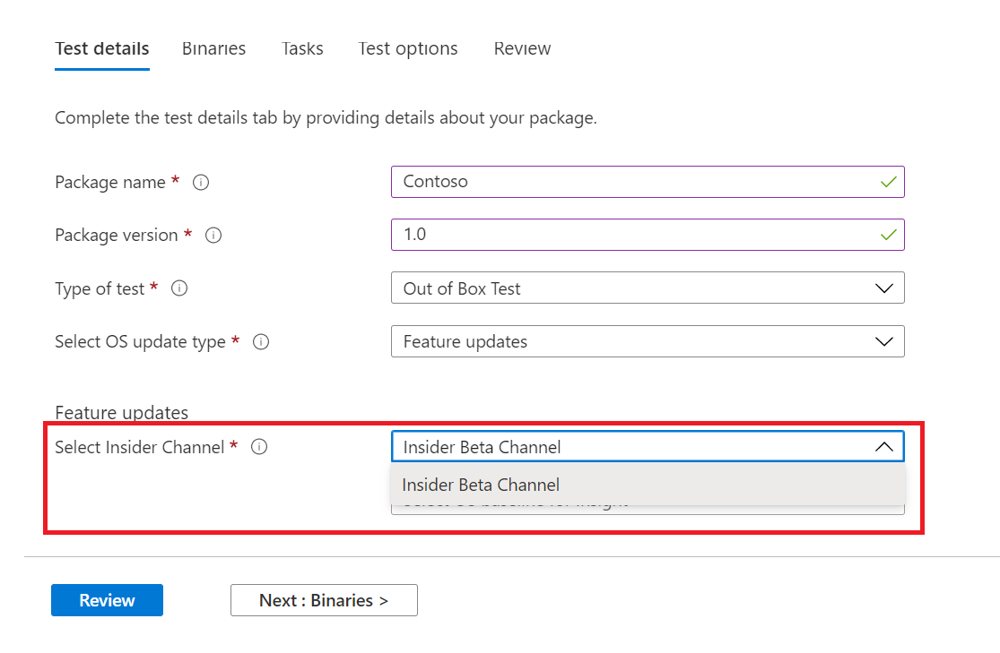

# <a name="windows-feature-update-validation"></a><span data-ttu-id="a68ab-103">Windows Validatie van functie-update</span><span class="sxs-lookup"><span data-stu-id="a68ab-103">Windows Feature update validation</span></span>

<span data-ttu-id="a68ab-104">Hebt u inzicht nodig in de manier waarop uw toepassingen zullen presteren met de volgende release van Windows 10 of Windows 11, zonder dat u een omgeving onderhoudt om nieuwe functies Windows valideren?</span><span class="sxs-lookup"><span data-stu-id="a68ab-104">Do you need insights on how your applications will perform with the next release of Windows 10 or Windows 11 - without you maintaining an environment to validate new Windows features?</span></span> 

<span data-ttu-id="a68ab-105">Wilt u uw validatietests uitvoeren met Windows Insider Program-builds in onze Azure-omgeving?</span><span class="sxs-lookup"><span data-stu-id="a68ab-105">Do you want to run your validation tests against Windows Insider Program builds in our Azure environment?</span></span>

<span data-ttu-id="a68ab-106">**Functie-updatevalidatie** op testbasis voor M365 kan u helpen al deze en meer te bereiken!</span><span class="sxs-lookup"><span data-stu-id="a68ab-106">**Feature update** validation on Test Base for M365 can help you achieve all these and more!</span></span>

<span data-ttu-id="a68ab-107">Bekijk het stapsgewijs overzicht hieronder om te zien hoe u toegang hebt tot deze nieuwe mogelijkheid in testbasis voor M365-service.</span><span class="sxs-lookup"><span data-stu-id="a68ab-107">Check out the step-by-step outline below to find out how to access this new capability in Test Base for M365 service.</span></span>

<span data-ttu-id="a68ab-108">Als u wilt beginnen met testbasis voor M365, uploadt u uw toepassingen (en gerelateerde bestanden) via de ```Feature update validation``` selfservice onboarding-portal.</span><span class="sxs-lookup"><span data-stu-id="a68ab-108">To get started with ```Feature update validation``` in Test Base for M365, upload your applications (and related files) through the self-service onboarding portal.</span></span> 

<span data-ttu-id="a68ab-109">Hieronder ziet u de stappen die u moet uitvoeren terwijl u de **testdetails invult:**</span><span class="sxs-lookup"><span data-stu-id="a68ab-109">Highlighted below are the steps to take as you fill out the **Test details**:</span></span>

1. <span data-ttu-id="a68ab-110">Selecteer **Functie-update als** uw type besturingssysteemupdate:</span><span class="sxs-lookup"><span data-stu-id="a68ab-110">Select **Feature Update** as your OS update type:</span></span>


2. <span data-ttu-id="a68ab-112">Kies het Windows Insider-kanaal waarvan u de toepassing wilt valideren.</span><span class="sxs-lookup"><span data-stu-id="a68ab-112">Choose the Windows Insider Channel against which you want your application validated.</span></span>  



3. <span data-ttu-id="a68ab-115">Selecteer een in-market release van Windows 10 of Windows 11 als basislijn voor uw test (en resulterende inzichten!) en geef de andere details die nodig zijn om uw pakket met succes aan te boord te nemen.</span><span class="sxs-lookup"><span data-stu-id="a68ab-115">Select an in-market release of Windows 10 or Windows 11 as the baseline for your test (and resulting insights!) and provide the other details required to onboard your package successfully.</span></span>


4. <span data-ttu-id="a68ab-117">Als u de resultaten van de validatie van uw toepassing wilt weergeven tegen vooraf uitgebrachte Windows 10 functie-updates, gaat u naar ```Feature Updates Test Results``` de .</span><span class="sxs-lookup"><span data-stu-id="a68ab-117">To view the results from the validation of your application against pre-released Windows 10 feature updates, visit the ```Feature Updates Test Results```.</span></span>


## <a name="next-steps"></a><span data-ttu-id="a68ab-119">Volgende stappen</span><span class="sxs-lookup"><span data-stu-id="a68ab-119">Next steps</span></span>

<span data-ttu-id="a68ab-120">Ga naar het volgende artikel om aan de slag te gaan met het begrijpen van geheugen regressieanalyse.</span><span class="sxs-lookup"><span data-stu-id="a68ab-120">Advance to the next article to get started with understanding Memory regression analysis.</span></span>
> [!div class="nextstepaction"]
> [<span data-ttu-id="a68ab-121">Volgende stap</span><span class="sxs-lookup"><span data-stu-id="a68ab-121">Next step</span></span>](memory.md)

<!---
Add button for next page
-->
