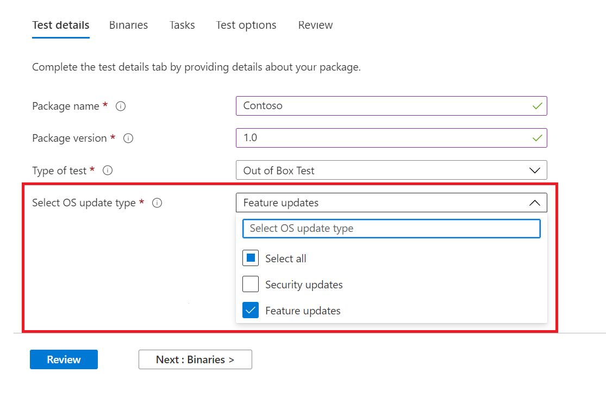

# <a name="windows-feature-update-validation"></a>Windows Validatie van functie-update

Hebt u inzicht nodig in de manier waarop uw toepassingen zullen presteren met de volgende release van Windows 10 of Windows 11, zonder dat u een omgeving onderhoudt om nieuwe functies Windows valideren? 

Wilt u uw validatietests uitvoeren met Windows Insider Program-builds in onze Azure-omgeving?

**Functie-updatevalidatie** op testbasis voor M365 kan u helpen al deze en meer te bereiken!

Bekijk het stapsgewijs overzicht hieronder om te zien hoe u toegang hebt tot deze nieuwe mogelijkheid in testbasis voor M365-service.

Als u wilt beginnen met testbasis voor M365, uploadt u uw toepassingen (en gerelateerde bestanden) via de ```Feature update validation``` selfservice onboarding-portal. 

Hieronder ziet u de stappen die u moet uitvoeren terwijl u de **testdetails invult:**

1. Selecteer **Functie-update als** uw type besturingssysteemupdate:



2. Kies het Windows Insider-kanaal waarvan u de toepassing wilt valideren.  


3. Selecteer een in-market release van Windows 10 of Windows 11 als basislijn voor uw test (en resulterende inzichten!) en geef de andere details die nodig zijn om uw pakket met succes aan te boord te nemen.


4. Als u de resultaten van de validatie van uw toepassing wilt weergeven tegen vooraf uitgebrachte Windows 10 functie-updates, gaat u naar ```Feature Updates Test Results``` de .


## <a name="next-steps"></a>Volgende stappen

Ga naar het volgende artikel om aan de slag te gaan met het begrijpen van geheugen regressieanalyse.
> [!div class="nextstepaction"]
> [Volgende stap](memory.md)

<!---
Add button for next page
-->
