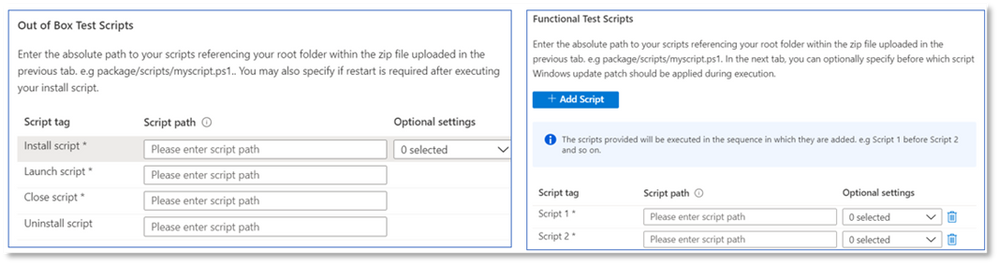
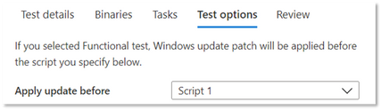

# <a name="functional-testing"></a>Functioneel testen

Als softwareleverancier kunt u nu aangepaste functionele tests uitvoeren, met behulp van het testkader van uw keuze- via de self-serve Test Base voor M365-portal. 

Toen we de service in eerste instantie startte, hebben we de standaardtests aangeboden. Dit is een vooraf gedefinieerde set tests die wordt uitgevoerd via gestandaardiseerde scripts. Dit kan echter niet tot volledige testdekking voor veel onafhankelijke softwareleveranciers (ISV's) komen. 

Daarom bieden we onze isv's in antwoord op uw feedback de mogelijkheid om geautomatiseerde functionele tests te uploaden.

Als u deze functie wilt gebruiken, volgt u de onderstaande stappen:

1. Upload bestanden (binaries, afhankelijkheden en scripts) als één .zip pakket.
2. Kies of u de test Virtuele machines (VM's) op verschillende uitvoeringspunten opnieuw wilt starten.
3. Beschikbare opties voor uw scripts beheren.
4. Kies wanneer u de update Windows VM wilt toepassen tijdens de uitvoering.

Gedetailleerde beschrijvingen van de bovenstaande stappen worden hieronder gemarkeerd:

**Upload een functioneel testpakket**

Als u wilt beginnen, gaat u naar de Upload pagina en selecteert u Upload nieuwe toepassing onder Toepassingscatalogus in het navigatiemenu aan de linkerkant van de testbasis voor M365-portal in Azure. Van hier uit:

Tab 1 - Voer basisgegevens in. Geef de naam en versie van uw toepassing op. Selecteer in de optie Type test ```Functional tests``` de optie . 

*De optie Out-of-Box (OOB) is standaard vereist.*


Tab 2 - Upload de onderdelen van uw pakket door een zip-bestand te uploaden met uw hele test (binaries, afhankelijkheden, scripts, enzovoort). 

Zie aka.ms/usl-package-outline voor meer informatie. (Opmerking: Zowel de out-of-box-testscripts als de inhoud van de functionele test moeten in hetzelfde zip-bestand worden geplaatst. Momenteel is de bestandsgrootte beperkt tot 2 GB.

Tab 3- Configureer de taken Voor de out-of-box- en functionele test. Kies hier het pad(en) naar de PowerShell-scripts die uw toepassing (voor Out-of-Box) installeren, starten, sluiten en verwijderen, evenals de pad(s) naar al uw aangepaste scripts om uw functionele test uit te voeren. **(Opmerking: een script om de toepassing te verwijderen is optioneel).**

Momenteel kunt u tussen 1 en 8 scripts uploaden voor uw functionele tests. (Een vriendelijke opmerking over dit bericht als u meer scripts nodig hebt!)



(Optioneel) Een herstart configureren na de installatie. Voor sommige toepassingen is een herstart na de installatie vereist. 

Selecteer voor het specifieke script op het tabblad Taken als u een herstart wilt uitvoeren ```Reboot After Execution``` na de uitvoering van dat script.

Tab 4- Kies wanneer de update Windows wordt geïnstalleerd: De toepassing van de update-Windows update wordt uitgevoerd voordat een script naar keuze wordt uitgevoerd. U wordt aangeraden een update Windows na de installatie van de toepassing te installeren om uw scenario's voor toepassingsgebruik in de echte wereld na te bootsen.



Tab 5- Bekijk en maak het pakket. Nadat u de bovenstaande stappen hebt voltooid, selecteert u ```Create``` om het uploadproces te voltooien.

Nadat uw pakket is gemaakt, kunt u de verificatiestatus van uw pakket controleren.

We voeren een eerste test uit om uw toepassing te installeren, te starten, te sluiten en te verwijderen. Op deze manier kunnen we controleren of uw pakket foutloos op onze service kan worden geïnstalleerd.

Het verificatieproces kan tot 24 uur duren. Wanneer de verificatie is voltooid, kunt u de status in het menu zien, wat een van de twee items ```Manage packages``` zou zijn:

1. Verificatie slaagt: het pakket wordt automatisch getest op pre-release Windows updates voor de os-builds die u hebt geselecteerd.
of
2. Verificatie mislukt: U moet de oorzaken van de fout onderzoeken, het probleem oplossen en uw pakket opnieuw uploaden.

U ontvangt ook een melding van een van beide resultaten via het meldingspictogram in de Azure-portal.
