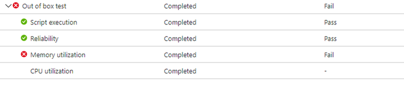

# <a name="memory-regression-analysis"></a>Geheugen regressieanalyse

Test Base helpt u duidelijker te zien dat het geheugengebruik aanzienlijk toeneemt in de test-VM's met uw apps. Prestatiegegevens, zoals geheugengebruik, kunnen een indicatie zijn van de algehele toepassingstoestand en we zijn van mening dat deze toevoeging uw apps optimaal kan laten presteren.

Lees verder voor meer informatie of bekijk deze video voor een beknopt overzicht van de meest recente verbeteringen. 

Zie Regressieresultaten op basis van procesbetrouwbaarheid voor meer informatie over de mogelijkheid van M365 om te helpen bij regressieanalyse.

<b>Geheugen regressies nader bekijken</b>

Het testbasisdashboard voor M365 toont het geheugen dat door uw toepassing wordt verbruikt bij een nieuwe, vooraf uitgebrachte Windows-update en vergelijkt het met het geheugen dat is gebruikt door de laatst uitgebrachte Windows update. 

Met de verbeteringen van deze maand wordt geheugen-regressieanalyse nu opgenomen in uw favoriete processen. Toepassingen kunnen meerdere processen bevatten en u kunt uw favoriete processen handmatig selecteren via het tabblad Betrouwbaarheid. Onze service identificeert vervolgens geheugenregressies in deze favoriete processen en vergelijkt test uitgevoerd in verschillende versies Windows updatereleases. Als een regressie wordt gedetecteerd, zijn details over de regressie eenvoudig beschikbaar.

Laten we deze functie nu in detail bekijken en bespreken hoe u geheugenregressies kunt oplossen met Windows Performance Analyzer.

Het foutsignaal dat wordt veroorzaakt door een geheugen regressie, wordt weergegeven in het dashboard Testbasis voor M365 op de pagina Testresultaten onder Geheugengebruik:




Fout voor de toepassing als gevolg van een hoger geheugenverbruik, wordt ook weergegeven zoals ```Fail``` op de pagina Testoverzicht:


Door deze foutsignalen vooraf op te geven, is het ons doel om duidelijke markeringen te geven voor mogelijke problemen die de ervaring van de eindgebruiker voor uw toepassing kunnen verstoren en beïnvloeden. 

Vervolgens kunt u de logboekbestanden downloaden en de Windows Performance Analyzer of de gewenste toolkit gebruiken om verder te onderzoeken. U kunt ook samenwerken met het Test Base voor M365-team om het probleem te verhelpen en problemen met eindgebruikers te voorkomen.

Geheugensignalen worden vastgelegd op het tabblad Geheugengebruik in de Testbasis voor M365-service voor alle testuitjes. In het onderstaande voorbeeld ziet u een recente test met de onboarded-toepassing 'Smoke Test Memory Stress' tegen de beveiligingsupdate van augustus 2020 van vóór de release. (Deze toepassing is geschreven door ons team om geheugen regressies te illustreren.)


In dit voorbeeld heeft het favoriete proces 'USLTestMemoryStress.exe' een gemiddelde van ongeveer 100 MB verbruikt in de update van augustus vóór de release van augustus in vergelijking met de uitgebrachte update van juli, vandaar dat in de testbasis voor M365 een regressie is vastgesteld. 

De andere processen, hier weergegeven als 'USLTestMemoryStress_Aux1.exe' en 'USLTestMemoryStress_Aux2.exe', behoren ook tot dezelfde toepassing, maar verbruikten ongeveer dezelfde hoeveelheid geheugen voor de twee versies, zodat ze 'zijn doorgegeven' en als gezond werden beschouwd.

De regressie in het hoofdproces werd bepaald als 'statistisch significant', dus de service communiceerde en gemarkeerde dit verschil voor de gebruiker. Als de vergelijking statistisch niet significant was, werd deze niet gemarkeerd. Geheugengebruik kan luidruchtig zijn, dus gebruiken we statistische modellen om tussen builds en releases duidelijke verschillen te onderscheiden van inconsequentiële verschillen. 

Een vergelijking kan zelden worden gemarkeerd als er geen waar verschil is (een onwaar positief), maar dit is een noodzakelijke afweging om de kans op het correct identificeren van regressies (of echte positieven) te verbeteren.)

De volgende stap is om te begrijpen wat de oorzaak is van de regressie van het geheugen. U kunt de zip-bestanden voor beide uitvoeringen downloaden via de optie Logboekbestanden downloaden, zoals hieronder wordt weergegeven. 

Deze zip-bestanden bevatten de resultaten van de test, inclusief scriptresultaten en geheugen- en CPU-prestatiegegevens die zijn opgenomen in het ETL-bestand.


U kunt de logboeken voor de twee testversies downloaden en uitlijnen, vervolgens het ETL-bestand in elke map zoeken en de naam ervan wijzigen als target.etl (voor de test uitgevoerd op de pre-releaseupdate) en baseline.etl (voor de test uitgevoerd op de laatst uitgebrachte update) om de verkenning en navigatie te vereenvoudigen.
 
## <a name="next-steps"></a>Volgende stappen

Ga naar het volgende artikel om aan de slag te gaan met het begrijpen van intelligente CPU-regressieanalyse.
> [!div class="nextstepaction"]
> [Volgende stap](cpu.md)

<!---
Add button for next page
-->
