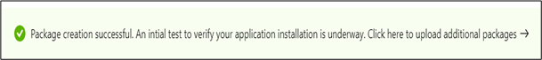

# <a name="step-6-review-your-selections-to-create-your-package"></a>Stap 6: Bekijk uw selecties om uw pakket te maken.

1.  Op dit tabblad worden de testdetails weergegeven en wordt een snelle volledigheidscontrole uitgevoerd. 

    In ```Validation passed``` een of bericht wordt weergegeven of u verder kunt gaan met de volgende stappen of ```Validation failed``` niet.

2.  Controleer de testdetails en klik op de knop als u tevreden ```Create``` bent. 


3.  Hiermee wordt uw pakket aan boord van de Test Base-omgeving. Als uw pakket is gemaakt, wordt een geautomatiseerde test gestart waarmee wordt gecontroleerd of uw pakket kan worden uitgevoerd op Azure.



> [!Note]
> U ontvangt een melding van de Azure-portal om u op de hoogte te stellen van het wel of niet slagen van de verificatie van het pakket. 
>
> Houd er rekening mee dat het proces tot 24 uur kan duren, dus het is waarschijnlijk dat uw webpagina een time-out krijgt als u niet actief bent en daarom wordt u niet op de hoogte van de voltooiing van deze on-demand run. 

  - Als dit gebeurt, kunt u de status van uw pakket bekijken op het ```Manage packages``` tabblad.


  - Voor succesvolle tests kunnen de resultaten worden weergegeven via de pagina's en de pagina's met een geplande tussenpozen, die vaak enkele dagen na het uploaden ```Test Summary``` ```Security Updates Results``` ```Feature Updates Results``` beginnen.
  
  - Als u mislukte tests hebt uitgevoerd, moet u een nieuw pakket uploaden. 
  
    U kunt de voor ```test logs``` verdere analyse downloaden van de ' en ```Security update results``` ```Feature updates results``` pagina's.

  - Als u herhaaldelijk testfouten hebt, kunt u contact testbasepreview@microsoft.com met de details van uw fout. 

## <a name="next-steps"></a>Volgende stappen

Ontdek onze inhoudsrichtlijnen via de onderstaande koppeling.
> [!div class="nextstepaction"]
> [Volgende stap](contentguideline.md)
