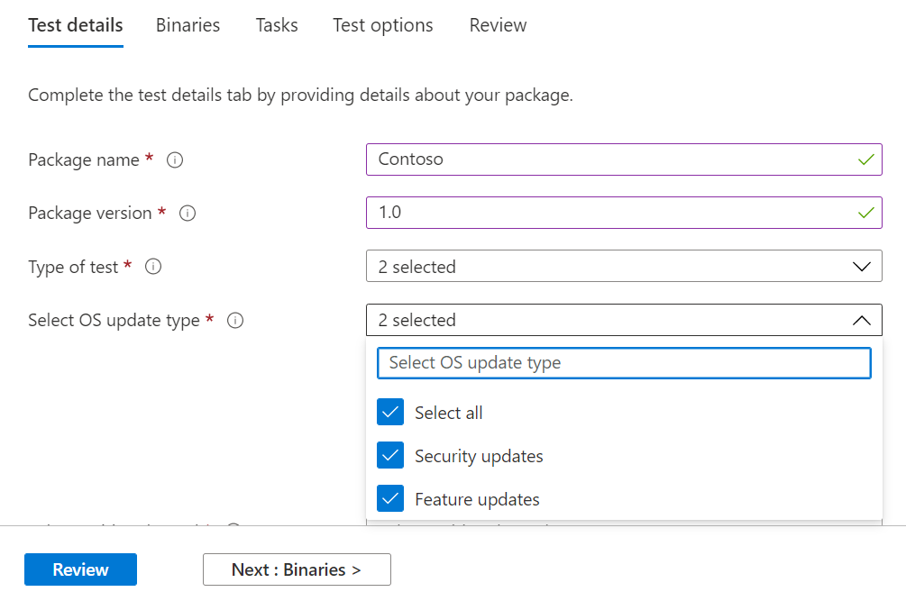

# <a name="step-2-uploading-a-package"></a><span data-ttu-id="a3023-103">Stap 2: Een pakket uploaden</span><span class="sxs-lookup"><span data-stu-id="a3023-103">Step 2: Uploading a Package</span></span>

<span data-ttu-id="a3023-104">Ga op de pagina Test Base portal naar de optie 'Upload nieuw pakket op de linkernavigatiebalk zoals hieronder wordt weergegeven: </span><span class="sxs-lookup"><span data-stu-id="a3023-104">On the Test Base portal page, navigate to the ‘Upload new package option on the left navigation bar as shown below: </span></span>

<span data-ttu-id="a3023-105">Volg de onderstaande stappen om een nieuw pakket te uploaden.</span><span class="sxs-lookup"><span data-stu-id="a3023-105">Once there, follow the steps below to upload a new package.</span></span>

## <a name="enter-details-for-your-package"></a><span data-ttu-id="a3023-106">Details voor uw pakket invoeren</span><span class="sxs-lookup"><span data-stu-id="a3023-106">Enter details for your package</span></span>

<span data-ttu-id="a3023-107">Typ op het tabblad Testdetails de naam, versie en andere details van uw pakket op de gevraagde manier.</span><span class="sxs-lookup"><span data-stu-id="a3023-107">On the Test details tab, type in your package's name, version and other details as requested.</span></span> 

<span data-ttu-id="a3023-108">**Out-of-Box en** **Functionele tests** kunnen worden uitgevoerd via dit dashboard.</span><span class="sxs-lookup"><span data-stu-id="a3023-108">**Out-of-Box** and **Functional testing** can be done via this dashboard.</span></span>

<span data-ttu-id="a3023-109">In de onderstaande stappen vindt u een handleiding voor het invullen van uw pakketdetails:</span><span class="sxs-lookup"><span data-stu-id="a3023-109">The steps below provides a guide on how to fill out your package details:</span></span>

1.  <span data-ttu-id="a3023-110">**Voer de naam in om uw pakket in het veld te ```“Package name``` krijgen.**</span><span class="sxs-lookup"><span data-stu-id="a3023-110">**Enter the name to be given your package in the ```“Package name``` field.**</span></span>

> [!Note]  
> <span data-ttu-id="a3023-111">De opgegeven pakketnaam en versiecombinatie moeten uniek zijn binnen uw organisatie.</span><span class="sxs-lookup"><span data-stu-id="a3023-111">The package name and version combination entered must be unique within your organization.</span></span> <span data-ttu-id="a3023-112">Dit wordt gevalideerd door het vinkje zoals hieronder wordt weergegeven.</span><span class="sxs-lookup"><span data-stu-id="a3023-112">This is validated by the checkmark as shown below.</span></span>
  
  - <span data-ttu-id="a3023-113">Als u ervoor kiest om de naam van een pakket opnieuw te gebruiken, moet het versienummer uniek zijn (dat wil zeggen nooit gebruikt met een pakket met die specifieke naam).</span><span class="sxs-lookup"><span data-stu-id="a3023-113">If you choose to re-use an package's name, then the version number must be unique (i.e. never been used with an package bearing that particular name).</span></span>
  - <span data-ttu-id="a3023-114">Als de combinatie van de pakketnaam + versie niet door de uniekheidscontrole komt, ziet u een foutbericht met de tekst 'Pakket met deze pakketversie bestaat *al'.*</span><span class="sxs-lookup"><span data-stu-id="a3023-114">If the combination of the package name + version does not pass the uniqueness check, you will see an error message which reads, *“Package with this package version already exists”*.</span></span> 


2. <span data-ttu-id="a3023-116">**Voer een versie in het veld 'Pakketversie' in.**</span><span class="sxs-lookup"><span data-stu-id="a3023-116">**Enter a version in the “Package version” field.**</span></span>


3.  <span data-ttu-id="a3023-118">**Selecteer het type test dat u wilt uitvoeren in dit pakket**</span><span class="sxs-lookup"><span data-stu-id="a3023-118">**Select the type of test you want to run on this package**</span></span>

    <span data-ttu-id="a3023-119">Bij **een OOB-test (Out-of-Box)** wordt een *installatie* uitgevoerd, *het* pakket *starten,* sluiten *en* verwijderen.</span><span class="sxs-lookup"><span data-stu-id="a3023-119">An **Out-of-Box (OOB)** test performs an *install*, *launch*, *close* and *uninstall* of your package.</span></span> <span data-ttu-id="a3023-120">Na de installatie wordt de routine voor het sluiten van de start 30 keer herhaald voordat één installatie wordt uitgevoerd.</span><span class="sxs-lookup"><span data-stu-id="a3023-120">After the install, the launch-close routine is repeated 30 times before a single uninstall is run.</span></span> 
    
    <span data-ttu-id="a3023-121">Met deze OOB-test beschikt u over gestandaardiseerde telemetrie in uw pakket om de verschillende builds Windows vergelijken.</span><span class="sxs-lookup"><span data-stu-id="a3023-121">This OOB test provides you with standardized telemetry on your package to compare across Windows builds.</span></span>

    <span data-ttu-id="a3023-122">Met **een functionele test** worden uw geüploade testscripts op uw pakket uitgevoerd.</span><span class="sxs-lookup"><span data-stu-id="a3023-122">A **Functional test** would execute your uploaded test script(s) on your package.</span></span> <span data-ttu-id="a3023-123">De scripts worden in de volgorde van uploaden uitgevoerd en een fout in een bepaald script stopt met het uitvoeren van de volgende scripts.</span><span class="sxs-lookup"><span data-stu-id="a3023-123">The scripts are run in upload sequence and a failure in a particular script will stop subsequent scripts from executing.</span></span>

> [!Note]
> <span data-ttu-id="a3023-124">**Alle** scripts worden ten hoogst 80 minuten uitgevoerd.</span><span class="sxs-lookup"><span data-stu-id="a3023-124">**All** scripts run for 80 minutes at the most.</span></span> 
    
4.  <span data-ttu-id="a3023-125">**Het type besturingssysteemupdate selecteren**</span><span class="sxs-lookup"><span data-stu-id="a3023-125">**Select the OS update type**</span></span>

   - <span data-ttu-id="a3023-126">Met de 'Beveiligingsupdates' kan uw pakket worden getest op incrementele churns van Windows maandelijkse beveiligingsupdates die vooraf worden uitgebracht.</span><span class="sxs-lookup"><span data-stu-id="a3023-126">The ‘Security updates’ enables your package to be tested against incremental churns of Windows pre-release monthly security updates.</span></span> 
   - <span data-ttu-id="a3023-127">Met de 'Functie-updates' kan uw pakket worden getest Windows tweejaarlijkse functieupdates van de Windows Insider-programma.</span><span class="sxs-lookup"><span data-stu-id="a3023-127">The ‘Feature updates’ enables your package to be tested against Windows pre-release bi-annual feature updates builds from the Windows Insider Program.</span></span>
<!---
Change to the correct picture
-->


5.  <span data-ttu-id="a3023-129">**Selecteer de besturingssysteemversie(s) voor beveiligingsupdatetests.**</span><span class="sxs-lookup"><span data-stu-id="a3023-129">**Select the OS version(s) for Security update tests.**</span></span>

<span data-ttu-id="a3023-130">Selecteer in de vervolgkeuzekeuze voor meerdere opties de besturingssysteemversie(s) van Windows waarin uw pakket wordt geïnstalleerd.</span><span class="sxs-lookup"><span data-stu-id="a3023-130">In the multi-select dropdown, select the OS version(s) of Windows your package will be installed on.</span></span> 

  - <span data-ttu-id="a3023-131">Als u uw pakket wilt testen Windows alleen client-OSes, selecteert u de toepasselijke Windows 11 OS-versies in de menulijst.</span><span class="sxs-lookup"><span data-stu-id="a3023-131">To test your package against Windows Client OSes only, select the applicable Windows 11 OS versions from the menu list.</span></span>
  - <span data-ttu-id="a3023-132">Als u uw pakket alleen wilt Windows server-OSes, selecteert u de toepasselijke Windows serverbesturingssysteemversies in de menulijst.</span><span class="sxs-lookup"><span data-stu-id="a3023-132">To test your package against Windows Server OSes only, select the applicable Windows Server OS versions from the menu list.</span></span>
  - <span data-ttu-id="a3023-133">Als u uw pakket wilt testen Windows client en server-OSes, selecteert u alle toepasselijke OSe's in de menulijst.</span><span class="sxs-lookup"><span data-stu-id="a3023-133">To test your package against Windows Client and Server OSes, select all applicable OSes from the menu list.</span></span> 

> [!Note]
> <span data-ttu-id="a3023-134">Als u ervoor kiest om uw pakket te testen op zowel Server- als Client-OSes, controleert u of het pakket compatibel is en kan worden uitgevoerd op beide OSes</span><span class="sxs-lookup"><span data-stu-id="a3023-134">If you select to test your package against both Server and Client OSes, please make sure that the package is compatible and can run on both OSes</span></span>


<!---
Change to the correct picture
-->
6.  <span data-ttu-id="a3023-136">**Selecteer opties voor functieupdatetests:**</span><span class="sxs-lookup"><span data-stu-id="a3023-136">**Select options for Feature update tests:**</span></span>

  - <span data-ttu-id="a3023-137">Selecteer in de optie 'Insider-kanaal selecteren' de build waarmee uw pakketten ```Windows Insider Program Channel``` moeten worden getest.</span><span class="sxs-lookup"><span data-stu-id="a3023-137">On the option to “Select Insider Channel”, select the ```Windows Insider Program Channel``` as the build which your packages should be tested against.</span></span>
  
    <span data-ttu-id="a3023-138">We gebruiken momenteel builds die worden uitgezonden in het Insider Beta-kanaal.</span><span class="sxs-lookup"><span data-stu-id="a3023-138">We currently use builds flighted in the Insider Beta Channel.</span></span>

  - <span data-ttu-id="a3023-139">Selecteer in de optie 'Selecteer OS-basislijn voor Inzicht' de Windows os-versie die als basislijn moet worden gebruikt om de testresultaten te vergelijken.</span><span class="sxs-lookup"><span data-stu-id="a3023-139">On the option to “Select OS baseline for Insight”, select the Windows OS version to be used as a baseline in comparing your test results.</span></span> 

> [!Note]
> <span data-ttu-id="a3023-140">We bieden momenteel geen ondersteuning voor het testen van functieupdates voor Server-OSes</span><span class="sxs-lookup"><span data-stu-id="a3023-140">We DO NOT support Feature update testing for Server OSes at this time</span></span>
<!---
Note to actual note format for markdown
-->
<!---
Change to the correct picture
-->


7.  <span data-ttu-id="a3023-142">Een pagina met voltooide testdetails ziet er als volgende uit:</span><span class="sxs-lookup"><span data-stu-id="a3023-142">A completed Test details page should look like this:</span></span> 


## <a name="next-steps"></a><span data-ttu-id="a3023-144">Volgende stappen</span><span class="sxs-lookup"><span data-stu-id="a3023-144">Next steps</span></span>

<span data-ttu-id="a3023-145">Ons volgende artikel gaat over Het uploaden van uw binaries naar onze serivce.</span><span class="sxs-lookup"><span data-stu-id="a3023-145">Our next article covers Uploading your Binaries to our serivce.</span></span>
> [!div class="nextstepaction"]
> [<span data-ttu-id="a3023-146">Volgende stap</span><span class="sxs-lookup"><span data-stu-id="a3023-146">Next step</span></span>](binaries.md)

<!---
Add button for next page
-->

