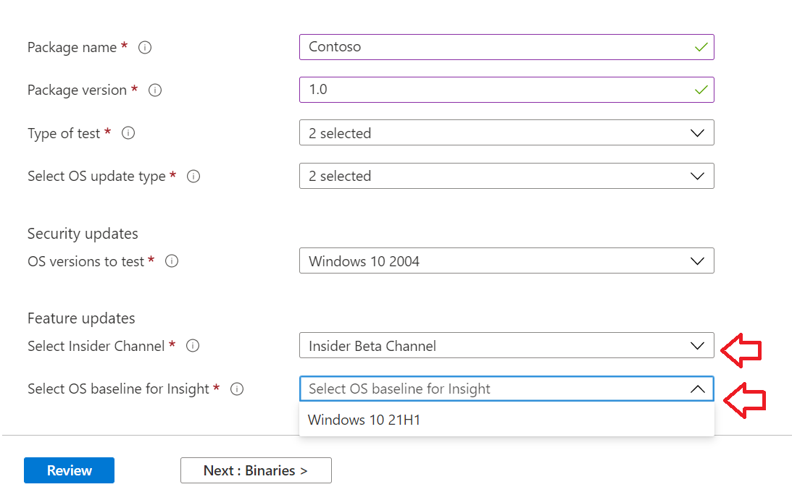

# <a name="step-2-uploading-a-package"></a>Stap 2: Een pakket uploaden

Ga op de pagina Test Base portal naar de optie 'Upload nieuw pakket op de linkernavigatiebalk zoals hieronder wordt weergegeven: 

Volg de onderstaande stappen om een nieuw pakket te uploaden.

## <a name="enter-details-for-your-package"></a>Details voor uw pakket invoeren

Typ op het tabblad Testdetails de naam, versie en andere details van uw pakket op de gevraagde manier. 

**Out-of-Box en** **Functionele tests** kunnen worden uitgevoerd via dit dashboard.

In de onderstaande stappen vindt u een handleiding voor het invullen van uw pakketdetails:

1.  **Voer de naam in om uw pakket in het veld te ```“Package name``` krijgen.**

> [!Note]  
> De opgegeven pakketnaam en versiecombinatie moeten uniek zijn binnen uw organisatie. Dit wordt gevalideerd door het vinkje zoals hieronder wordt weergegeven.
  
  - Als u ervoor kiest om de naam van een pakket opnieuw te gebruiken, moet het versienummer uniek zijn (dat wil zeggen nooit gebruikt met een pakket met die specifieke naam).
  - Als de combinatie van de pakketnaam + versie niet door de uniekheidscontrole komt, ziet u een foutbericht met de tekst 'Pakket met deze pakketversie bestaat *al'.* 


2. **Voer een versie in het veld 'Pakketversie' in.**


3.  **Selecteer het type test dat u wilt uitvoeren in dit pakket**

    Bij **een OOB-test (Out-of-Box)** wordt een *installatie* uitgevoerd, *het* pakket *starten,* sluiten *en* verwijderen. Na de installatie wordt de routine voor het sluiten van de start 30 keer herhaald voordat één installatie wordt uitgevoerd. 
    
    Met deze OOB-test beschikt u over gestandaardiseerde telemetrie in uw pakket om de verschillende builds Windows vergelijken.

    Met **een functionele test** worden uw geüploade testscripts op uw pakket uitgevoerd. De scripts worden in de volgorde van uploaden uitgevoerd en een fout in een bepaald script stopt met het uitvoeren van de volgende scripts.

> [!Note]
> **Alle** scripts worden ten hoogst 80 minuten uitgevoerd. 
    
4.  **Het type besturingssysteemupdate selecteren**

   - Met de 'Beveiligingsupdates' kan uw pakket worden getest op incrementele churns van Windows maandelijkse beveiligingsupdates die vooraf worden uitgebracht. 
   - Met de 'Functie-updates' kan uw pakket worden getest Windows tweejaarlijkse functieupdates van de Windows Insider-programma.
<!---
Change to the correct picture
-->


5.  **Selecteer de besturingssysteemversie(s) voor beveiligingsupdatetests.**

Selecteer in de vervolgkeuzekeuze voor meerdere opties de besturingssysteemversie(s) van Windows waarin uw pakket wordt geïnstalleerd. 

  - Als u uw pakket wilt testen Windows alleen client-OSes, selecteert u de toepasselijke Windows 11 OS-versies in de menulijst.
  - Als u uw pakket alleen wilt Windows server-OSes, selecteert u de toepasselijke Windows serverbesturingssysteemversies in de menulijst.
  - Als u uw pakket wilt testen Windows client en server-OSes, selecteert u alle toepasselijke OSe's in de menulijst. 

> [!Note]
> Als u ervoor kiest om uw pakket te testen op zowel Server- als Client-OSes, controleert u of het pakket compatibel is en kan worden uitgevoerd op beide OSes


<!---
Change to the correct picture
-->
6.  **Selecteer opties voor functieupdatetests:**

  - Selecteer in de optie 'Insider-kanaal selecteren' de build waarmee uw pakketten ```Windows Insider Program Channel``` moeten worden getest.
  
    We gebruiken momenteel builds die worden uitgezonden in het Insider Beta-kanaal.

  - Selecteer in de optie 'Selecteer OS-basislijn voor Inzicht' de Windows os-versie die als basislijn moet worden gebruikt om de testresultaten te vergelijken. 

> [!Note]
> We bieden momenteel geen ondersteuning voor het testen van functieupdates voor Server-OSes
<!---
Note to actual note format for markdown
-->
<!---
Change to the correct picture
-->


7.  Een pagina met voltooide testdetails ziet er als volgende uit: 


## <a name="next-steps"></a>Volgende stappen

Ons volgende artikel gaat over Het uploaden van uw binaries naar onze serivce.
> [!div class="nextstepaction"]
> [Volgende stap](binaries.md)

<!---
Add button for next page
-->

